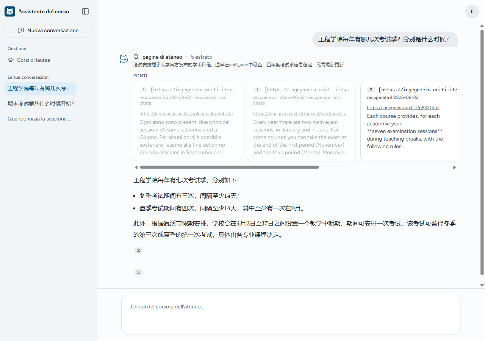

# multilingual-course-assistant

Ask about a university course or about the campus in any language, and the answer comes back in that language, citing the slide or web page it was drawn from, even when the material is in another language: an English question over the university's Italian web pages, an Italian one over English slides. Retrieval-augmented generation over open-weights models (the Qwen family), with a Django + React website in front; generating or grading exercises is ⛔ out of scope.



Bachelor's thesis in Information Engineering at the University of Florence, supervised by Prof. Marco Bertini. MIT licence.

**Run it** with Docker, uv and Node.js installed, in PowerShell or any POSIX shell:

```shell
git clone https://github.com/Zhengjunliang/multilingual-course-assistant.git
cd multilingual-course-assistant
uv sync
npm ci --prefix frontend
npm run build --prefix frontend
cp .env.example .env               # set DJANGO_SECRET_KEY (the file has the command) and a DJANGO_DB_PASSWORD of your choice
docker compose up -d --wait        # PostgreSQL and Qdrant, healthy
uv run python manage.py migrate
uv run python manage.py createsuperuser
uv run python manage.py runserver  # http://127.0.0.1:8000/
```

The site answers once it has an index and a model. Course PDFs are not part of the repository, so you index your own, and generation calls any OpenAI-compatible server, a local Ollama by default. Both steps and the development loop are in [docs/development.md](docs/development.md); the HTTP API is in [docs/api.md](docs/api.md).

Progress, milestones and blockers live in GitHub issues (milestones M3 · M4 · M5 · M6 · M7); decisions in force in [docs/decisions.md](docs/decisions.md); the architecture and the supervisor's constraints in [docs/architecture.md](docs/architecture.md); measured results in [docs/experiment-log.md](docs/experiment-log.md).
