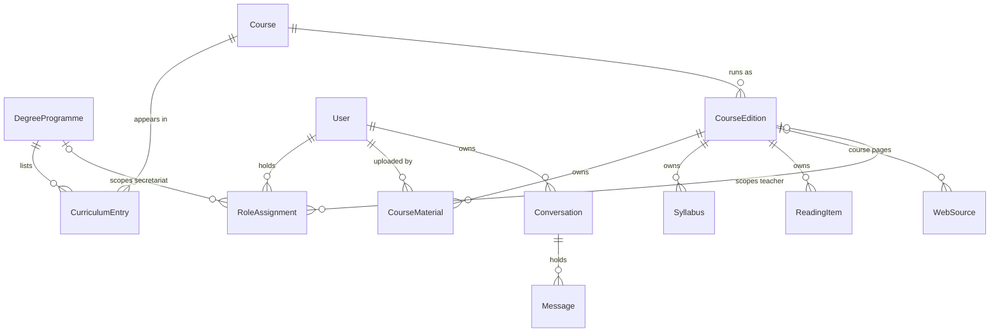

# Data model

## Purpose and owner

This file owns the website's relational schema: its entities and relationships, the scope invariants, the contract between `apps/` and `rag/`, and the concrete migration order. The decisions and their reasons are owned by [decisioni.md](decisioni.md), entries of 2026-09-25; the chunk field table by [docling-e-pipeline.md](docling-e-pipeline.md), section 3.6 (the chunk payload contract). Progress lives in GitHub issues: the epic `#94`, and `#35` `#36` `#93` for the parts they implement.

## Entities and relationships

✅ `User` exists in `apps/accounts/models.py`, `Conversation` and `Message` in `apps/qa/models.py`, and `DegreeProgramme`, `Course`, `CourseEdition` and `CurriculumEntry` in `apps/catalog/models.py`. 🔜 M5: every other entity below. `CourseEdition` is the centre: it owns the content, scopes a teacher, and is what a slides chunk's `course` and `academic_year` name. Rows with user-visible text carry `locale` — programme and course names, `Syllabus`, `ReadingItem`; relation tables and `CourseMaterial` do not, since a file's language is recorded per chunk.

## Scope invariants

🔶 Enforced by database constraints where a constraint can express them. ✅ The catalogue keys of invariant 1 and the constraint of invariant 2, in `apps/catalog/models.py`. 🔜 M5: the switch of invariant 2, the `WebSource` and `CourseMaterial` keys, and invariant 3.

1. **Keys.** `DegreeProgramme.code` and `Course.code` are unique. A `CourseEdition` is unique per (`course`, `academic_year`), and `academic_year` matches `^\d{4}-\d{4}$`. A `CurriculumEntry` is unique per (`programme`, `curriculum`, `ad_code`) and per (`programme`, `curriculum`, `course`), with an empty string, never NULL, for "no curriculum". A `WebSource` is unique per (`url`, `edition`) with NULLs not distinct; a `CourseMaterial` per (`edition`, `sha256`). What the keys hold: `Course.code` is the AD code of the Moodle course that holds the material, fixed once entered, and any other AD code of the course is a `CurriculumEntry.ad_code`; when one curriculum lists two AD codes for a course, its entry takes the one listed only in that curriculum; `curriculum` is the name the Cineca catalogue prints, such as `TECNICO APPLICATIVO`.
2. **One current edition per course.** A named conditional unique constraint on `course` where `is_current` is true. It cannot be deferred, so a switch runs in one transaction: lock the course's editions with `select_for_update`, clear the old flag, then set the new one.
3. **Role scopes.** A check constraint on `RoleAssignment`: a teacher row has an `edition` and no `programme`, a secretariat row the reverse; its unique constraint treats NULLs as not distinct. The administrator is Django's `is_superuser` and has no row. Whether students have rows is decided in `#93`. A student's programme is **a scope boundary, self-declared until `#44`**: it bounds the courses a student's search may cover, and it is not a security boundary.

## The contract between `apps/` and `rag/`

🔜 M5. `rag/` never imports Django, so no model instance crosses the boundary: only strings, `EditionKey(course, academic_year)` — a `NamedTuple` of two strings defined in `rag/` — and plain dicts.

- The search functions take `scope: Sequence[EditionKey] | None` in place of the single `course` string, keyword-only and with no default; the command line takes `--scope CODE:YEAR`.
- `scope=None` means unrestricted. The command line and the evaluation pass it, and so does `apps/qa/engine.py` for logged-in requests until `#36` computes a scope. The gold runs pin PPM's own pair, never `is_current`.
- `scope=[]` means the slides collection is skipped; an anonymous request passes it.
- The scope applies to the slides branch only, written inside each prefetch branch for the reason given in [docling-e-pipeline.md](docling-e-pipeline.md), section 4.1, under the fusion trap.
- In the web collection, `course` is a site-section slug such as `ingegneria` (values listed in [docling-e-pipeline.md](docling-e-pipeline.md), section 3.6), not a course key; a scope never matches it.

## `WebSource` and the registry

✅ `data/webcorpus/registry.jsonl`, written by `rag/crawl.py` and `rag/live.py`, is the append-only record of what was fetched; its layout is in [fonte-web-unifi.md](fonte-web-unifi.md), in the snapshot and registry layout section. 🔜 M5: `WebSource` is what should be fetched, edited by people — no edition for a campus page (the secretariat's), an edition for a course reference page (the teacher's). A task in `apps/` reads it and hands `rag.crawl` plain data derived from it; `rag/` never reads the table.

## Chunk payload mapping

✅ The field table and the web-side values are owned by [docling-e-pipeline.md](docling-e-pipeline.md), section 3.6, with the model in `rag/chunk.py`. 🔜 M5: in the slides collection, `course` holds a UniFi course code (`B028451` for PPM) instead of `"PPM"`, and an optional `academic_year` joins it, `None` by default. A slides `chunk_id` carries both, so one PDF in two editions yields two identities.

## Migration order

🔶 ① is in `apps/catalog/migrations/0001_initial.py`; 🔜 M5: ② to ④. Each step lands with the issue that first uses it. Until a database has to keep its data, a step rewrites its app's single `0001_initial.py` and the local database is rebuilt; from that database on, every step is a new migration that adds and drops nothing — [decisioni.md](decisioni.md), 2026-09-26.

- ① Catalogue tables: `DegreeProgramme`, `Course`, `CourseEdition`, `CurriculumEntry`.
- ② `RoleAssignment`, with the roles of `#93`.
- ③ Content tables — `CourseMaterial` (`#35`), `Syllabus`, `ReadingItem`, `WebSource` — and `User.year_of_study` with the student course list (`#36`).
- ④ The Qdrant payload remap, zero GPU: `set_payload` writes the course code and `academic_year`, and each slides point moves to its new id (scroll the stored vectors, upsert under the new id, delete the old one). The `data/parsed/*.meta.json` and `data/chunks/*.jsonl` sidecars are rewritten in the same batch.

④ is not a Django migration and reads no table: it needs only the course codes and years that ① records, not roles or content, so the issue that owns ① may run it before its own tables land. Stored history is not rewritten: `Message.citations[].course` keeps `"PPM"`.

## Blocked

- 🔒 **Global settings** (which model answers, and similar site-wide choices): unblocked by the model moving to the MICC servers, `#18`; owner `#51`.
- 🔒 **Student uploads** visible only to their author: unblocked by the thesis author reopening the decision; owner `#36`. They need one nullable `owner` column on `CourseMaterial`, an additive change.
