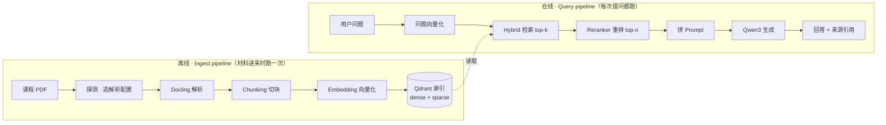
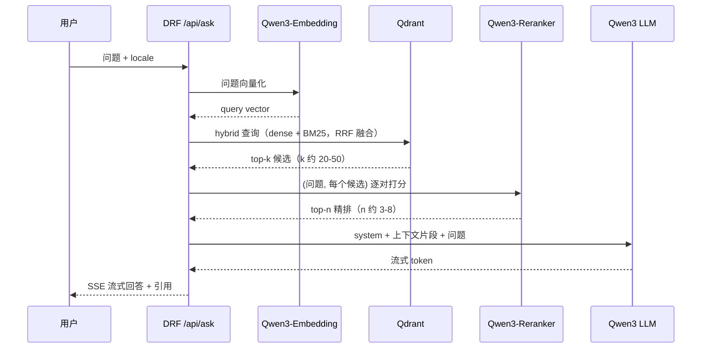

# Docling 与 RAG Pipeline — 原理与进度

面向开发的概念梳理 + ingest 进度。决策结论不在这里（属主是 [architettura.md](architettura.md)），路线对比不在这里（属主是 [analisi-rag.md](analisi-rag.md)）。本文回答：**每个环节在干什么、为什么需要它、本项目怎么落、进度在哪。**

进度一览：步骤 0 探测 ✅（[rag/probe.py](../rag/probe.py)）· 步骤 1 解析 ✅（[rag/parse.py](../rag/parse.py)）· 步骤 2 chunking ✅（[rag/chunk.py](../rag/chunk.py)）· 索引 ✅（[rag/index.py](../rag/index.py)）· hybrid 检索 + rerank ✅（[rag/search.py](../rag/search.py)）· 生成 ✅（[rag/answer.py](../rag/answer.py) 经本地 Ollama 实测，记录见 [diario-sperimentale.md](diario-sperimentale.md)；服务器 vLLM 只在 M3 正式实验）。

## 1. 全景：RAG 是两条 pipeline，不是一条

「RAG pipeline」这个词指两件不同的事，运行时机、失败方式、评估方式都不同：



三条心法：

- **Ingest 的错误会被永久固化。** 解析把两栏读成一栏、把 `perché` 读坏，之后再强的 LLM 也救不回来 —— 索引里就是错的。所以先验证解析质量，顺序不能反。
- **在线部分是线性流水线。** 无循环、无条件跳转、无「模型自己决定下一步」—— 这直接决定第 5 节的框架取舍。
- **LLM 是最后一步，也是最不重要的一步。** 检索没召回正确片段，生成只能编。M3 的 RAGAS 指标分开测 *context precision/recall*（检索）与 *faithfulness*（生成），就是为了把锅分清。

## 2. 步骤 0-1 · 探测与解析 ✅

### 2.1 Docling 解决什么问题

PDF 不是文档格式，是**打印指令格式**：文件里只有「在坐标 (x,y) 用某字体画字符」，没有「这是标题 / 表格 / 先读左栏」。`pypdf` 抽出的文本多栏交错、表格塌掉、词粘连。Docling 做**文档理解**：还原版面、阅读顺序、表格网格、公式，输出层级对象树 `DoclingDocument`。

**`DoclingDocument` 是统一中间表示**：不管走哪条 pipeline、输入什么格式，下游只面对同一个对象 → ingest 代码写一次，换 pipeline 只改配置。中间格式必须无损（Markdown 是有损的：表达不了页码、坐标、合并单元格 —— 而引用溯源恰恰需要这些），Markdown 只是最终展示格式。

### 2.2 两条 pipeline

| 维度 | 经典 pipeline | VlmPipeline（granite-docling 258M） |
| --- | --- | --- |
| 原理 | 多个专用小模型串联（layout + TableFormer + OCR + 富化） | 一个视觉语言模型端到端「看图写标记」 |
| 算力 | CPU 可跑（实测约 0.8-0.9s/页），本地够用 | 自回归逐 token 生成，GPU 也慢（33s/页） |
| 数字版 PDF | 稳，默认选择 | 未必更好，且慢 |
| 可调试性 | 每步中间产物可看 | 黑盒 |
| 失败模式 | 结构错（栏序、表格边界） | 幻觉（生成原文没有的内容） |

结论（实测支撑见 2.5）：**数字版 slide 走经典 pipeline；VLM 仅作对照与扫描件兜底，自动路由从不选它**，只经 `--profile manual --pipeline vlm` 手动可达。

### 2.3 解析质量验收（实测结论）

按语料实测（31 份 PPM slides，语料事实属主 [architettura.md](architettura.md)）：

| 验证点 | 结果 |
| --- | --- |
| 词间空格 | ✅ 修好：pypdf 的 `"Video isa sequenceof frames"` → `"Video is a sequence of frames"` —— BM25 能用了 |
| 连字 fi/fl | ✅ 17/31 份带连字（如 `micc.unifi.it`），`normalize_text()` NFKC 后残留为 0 |
| 重音字符 | ✅ `più` · `è` · `ambiguità` 正常 —— 意大利语 BM25 不废 |
| 表格 | ✅ 还原成真 markdown 表格，边界正确 |
| 标题层级 | ✅ 识别出 `##` 层级 → chunking 的标题链有料可用 |
| HTML 标签转义 | 🔶 不一致：正文 `&lt;div&gt;`，表格内裸 `<header>`；搜 `<nav>` 可能受影响，chunking 后评估 |
| 公式 | 🔶 富化关则**静默丢**（见 2.5）；开则产出 `$$` LaTeX，数值正确 |
| 图片 | 🔶 一律 `<!-- image -->` 占位 → **死 chunk 是本语料最大检索缺口**（见 2.5），补救 🔜 M3 图片描述 |

### 2.4 自适应路由：谁决定每份文件用哪套配置

富化开关（OCR、公式）默认全关，但**该开没开 = 内容永久丢失**；全开则 26/31 份纯文字讲义白付几十倍算力；让用户选是把答不上的问题推给他。生产级管线（unstructured.io `strategy="auto"`、Azure DI、Textract）都走同一结构：**先零成本探测，再按信号路由**。属主 [rag/probe.py](../rag/probe.py)：不加载模型、不渲染页面，直接读 PDF 结构的四个信号 —— 每页文字量、空页比例、图片对象数、字体表。

规则 v0：

| 条件 | 决策 | 依据 |
| --- | --- | --- |
| `empty_page_ratio > 0.3` | `ocr = True` | 文字层大面积缺失，只能从渲染页恢复。**不选 VLM**（对照实测见 2.5） |
| 字体表含 `Symbol` · `CM*` · `MT*` · `STIX` 等数学字体 | `formula = True` | 数学字体提供文本字体没有的符号 |
| 其余（有完好文字层） | 经典裸跑，OCR 保持关 | 开 OCR 产出完全相同却多耗 62% 时间 |

31 份实测分布：`classic + ocr` **1** 份（`3.5-HTML5-Part-2`：32 页中 16 页近空）· `classic + formula` **4** 份（图像/视频压缩理论那几份）· `classic` **26** 份。零误报，省掉 27/31 的公式模型加载与 30/31 的 OCR。

三个设计要点：

- **阈值是本语料实测值**（`EMPTY_PAGE_CHARS = 50`、`NEEDS_VISION_RATIO = 0.3`），不是通用真理，换语料要重标。
- **数学字体判定故意容忍误报**（PowerPoint 也用 `SymbolMT` 画项目符号）：富化模型逐公式区域自门控，误报代价是一次模型加载，漏报代价是公式永久消失 —— 不对称的代价配不对称的门槛。
- **级联升级只做到「打分并报告」**，自动重跑 🔜 M3 —— 重跑阈值必须用 gold set 调，现在拍脑袋就是给论文埋没依据的常数。

### 2.5 实测教训（每条都有论文价值）

- **OCR 对有文字层的 PDF 是纯浪费**：同一份 28 页 slides 开/关 OCR 产出字符完全相同（11040），时间 43.8s vs 27.0s → `do_ocr` 默认关（与 Docling 自身默认相反）。唯一例外是图片型的 `3.5`：527s 换来抽取量翻倍（10001 → 20032 字符），值。
- **VLM 输给 OCR，输在 RAG 最在意的地方**：`3.5-HTML5-Part-2` 双跑对照 —— OCR 527s / VLM 1059s；VLM 字符更多（22621 vs 20032）但**唯一词汇更少**（671 vs 729），丢的是 `avc1.42e01e` · `autoplay` · `codecs` 这类**技术字面量**，换成叙述性虚词。**VLM 在转述，OCR 在转录**；BM25 的命脉正是字面 token。死 section 也没救回（20 vs 19）。据此：空页比超阈值 → `classic + ocr`，不是 `vlm`。
- **公式占位符严重低估损失**：`2.1`（35 页）基线只有 1 个 `formula-not-decoded` 占位，开富化后出来 **4 个** LaTeX 公式 —— 另外 3 个在基线里连占位符都没有，**被静默丢弃**。判断公式丢多少只能开一次富化去比，不能数占位符。已知残留：Symbol 字体大括号拼的矩阵被 layout 判成 table，不走富化路径；VLM 生成的 LaTeX 数值可信但符号有幻觉。
- **死 chunk 量化（M3 图片描述消融的基线）**：9 份抽样（约 322 页）共 **401 个图片占位、63 个死 section**（标题下除 `<!-- image -->` 外零正文）。死的是课程主干：`Django's ORM` · `CRUD examples` · `Components of a Database`。极端例 `3.5`：19/19 全死。学生问「Django 的 ORM 怎么用」，索引里对应块是空的 —— 这就是 M3 `do_picture_description` 消融实验的分母。
- **批量视觉/生成任务必须上服务器**：VLM 与图片描述都是自回归生成，本地 GPU 单页串行喂不饱（batch=1 延迟受限），唯一有效杠杆是 batching —— 即 MICC 上 vLLM 的 continuous batching。本地只跑单份对照实验。
- **同一个开关、两个默认值（有意，不是 bug）**：公式富化在 `rag/parse.py` CLI 默认**关**（每次运行重付模型下载加载），M5 常驻 Celery worker 应默认**开**（加载一次，之后逐 item 自门控 ≈ 免费）。

## 3. 步骤 2 · Chunking ✅（[rag/chunk.py](../rag/chunk.py)）

### 3.1 为什么要切块

两个硬约束：① embedding 模型输入有上限，整份 PDF 塞不进去；② 检索粒度不能是「整份文档」—— 学生问一个具体问题，命中的应该是讲那件事的几张 slide，不是 1200 页语料里的某三份 PDF。chunk 是**检索的最小单位**：一段带元数据的文本。

切法直接决定检索质量，两个方向都会坏：**块太大** → 超出 embedding 输入被截断，或命中后把无关内容一起塞进 prompt；**块太小** → 一句孤立的话丢失上下文，向量落不到对的语义位置。

### 3.2 HybridChunker 怎么切

Docling 自带两个 chunker：

- **HierarchicalChunker**：按文档结构切 —— 一个元素（段落/列表/表格）一个 chunk，自动记下所属标题链。问题：slide 的元素长短悬殊，会产出大量碎块和超长块。
- **HybridChunker**（本项目用）：在结构切分之上加 **tokenizer 感知**的两遍精修：


结果：块边界尽量落在结构边界上（不腰斩表格、不跨章节），大小又贴着 embedding 模型的输入上限。

### 3.3 tokenizer 必须与 embedding 模型对齐

HybridChunker 数 token 用的 tokenizer 是**传进去的参数**。传错（比如用 GPT 的 tokenizer 数、Qwen 的模型编码），同一段文本两边数出的 token 数不同 → chunker 以为没超限，embedding 侧实际超了 → **尾部被静默截断，永远检索不到，且不报错**。这是最阴险的一类 bug。实现：`Qwen/Qwen3-Embedding-0.6B` 的 tokenizer 经 `HuggingFaceTokenizer` 包装（裸 transformers tokenizer 已被上游弃用），上限默认 512（CLI `--max-tokens`，M3 实验变量 —— 不是 Qwen3-Embedding 的 32k 输入上限，那不是检索粒度）。

### 3.4 contextualize()：标题链 + 正文才是 embedding 输入

slide 上一句孤立的 `Complessità: O(n log n)` 毫无检索价值 —— 向量不知道它在讲什么算法。`chunker.contextualize(chunk)` 返回「标题链 + 正文」：

```text
Algoritmi di ordinamento > Merge sort > Analisi
Complessità: O(n log n)
```

语义向量这才落在对的位置。**规则：dense embedding 永远吃 `contextualize()` 的输出，不吃裸文本。**

### 3.5 衔接点：HybridChunker 吃 DoclingDocument，不吃 Markdown

chunker 需要的是**带层级与页码的对象树**（标题链、provenance 都在里面，Markdown 表达不了）。所以 [rag/parse.py](../rag/parse.py) 每份落盘两个工件：`data/parsed/<名>.<配置>.json`（`save_as_json` 无损持久化，chunking 的唯一输入）+ `<名>.<配置>.meta.json`（溯源 sidecar：`source_sha256` · `parse_variant` · `docling_version` · `course` 等）。chunk 步骤只读这两个文件 —— 永不碰原 PDF、永不 import docling、永不重算哈希；重解析全语料（约 1 小时 × 每次实验）因此只需付一次。Markdown 输出已否决：只为人看，而 JSON 本身可读。

### 3.6 chunk payload 契约

每个 chunk 入索引时携带的字段，**从第一天就要带**（索引写入后无法回填，补数据比一开始写进去贵得多）。契约模型是 [rag/chunk.py](../rag/chunk.py) 的 `Chunk`，输出 `data/chunks/<名>.<配置>.jsonl` 一行一个：

| 字段 | 说明 |
| --- | --- |
| `chunk_id` | `sha256 前 16 位:配置:序号`，确定性 —— 同一语料快照 + 解析配置重跑得到相同 id，重建索引覆盖而非重复 |
| `chunk_index` | 文档内序号 |
| `text` | 原始块文本，NFKC —— sparse/BM25 侧 + 展示给用户 |
| `embed_text` | `contextualize()` 输出（标题过滤后），NFKC —— **仅 dense 侧** |
| `locale` | BCP-47 主子标签（小写 2-3 字母，pydantic pattern 校验）。优先级：CLI `--locale` 强制 > sidecar `lang`（web 侧 `<html lang>`）> 启发式（CJK 字符占比 ≥20% → `zh`，否则 it/en 停用词多数票、平局取 en） |
| `course` · `source_file` | 来自 sidecar；web 侧取值：`course` = 站点板块 slug（如 `ingegneria`）、`source_file` = URL path |
| `page` | 1-based，chunk 首个条目的首页 —— 引用「来源：第 12 页」与前端跳转的锚点；**web 侧 = 0 哨兵**（网页无页码，命中判定走 `urls`） |
| `pages` | 跨页完整列表（合并跨了 slide 边界时 `page` 仍指起点，`pages` 保留真相）；web 侧 = `[]` 或 `[0]` |
| `heading_path` | 过滤后的标题链，可空 |
| `parse_variant` · `docling_version` · `source_sha256` | 溯源：M3 消融要能把每个 chunk 归因到解析配置与语料快照 —— 与 `locale` 同一论证。web 侧：`parse_variant` = `"html"`、`source_sha256` = 原始 HTML/PDF 字节哈希 |
| `kind` | `"slides"` \| `"web"` 判别式，默认 `slides`——已入索引的旧 payload 与 slides 路径零改动 |
| `url` · `referrer_url` | web 溯源（可空，slides 恒 None = 合法终态）：`url` = 页面或附件 PDF 自身地址（引用给学生看），`referrer_url` = 附件的承载页（溯源用） |
| `fetch_date` · `section` | 抓取日期（引用 marker `[<url> · <fetch_date>]` 的第二半）与站点板块 |
| `ingest_run_id` · `ingest_source` · `trigger` | 快照身份：哪次 run、`"crawl"`（正式爬取）还是 `"live"`（学生触发实时抓取）、触发原因。eval 默认只取 `crawl`（filter 只进 `unifi_web` 的 prefetch 分支；slides 分支不带任何 ingest 条件） |
| `content_hash` | 页面内容哈希，增量刷新判定（变了才重解析重索引） |

**web chunk 的替换规则**：`chunk_id` 随 `content_hash` 变化（内容一变 id 全变），替换粒度是 **(url, ingest_source) 对**——入库前按该对限定删除再 upsert，crawl 快照与 live 增量**互不覆盖**（eval 隔离在写路径上的对偶）。快照/registry 布局与深化循环见 [fonte-web-unifi.md](fonte-web-unifi.md)。

NFKC 归一化（`rag/parse.py` 的 `normalize_text`）在**此步**应用于 `text` 与 `embed_text`：文档 JSON 保留原文，索引只见折叠后文本。

### 3.7 标题污染的对策（已定）

语料实测：重复页眉被识别为标题（`HTML &amp; CSS` 在一份 32 页 deck 里出现 21-32 次）。若每个 chunk 的 contextualize 前缀都是同一条标题链，dense 检索退化 —— 所有块的向量被拖向同一个方向。两个对策同时落地在 [rag/chunk.py](../rag/chunk.py)：

- **页面家具剔除**：标题在 ≥ `max(5, 20% 页数)` 个不同页出现即判为页眉（实测家具 21/32、32/32 页 vs 真章节 2-4 页，两侧余量都大），在 `contextualize()` 前从 chunk 元数据剔除 —— 同一步离开 `heading_path` 与 `embed_text`，文档结构不动。
- **标题链只进 dense 侧**：`text`（裸正文，BM25 侧）与 `embed_text`（带标题链，dense 侧）分存，见 3.6。

### 3.8 代码形状

```python
from docling.document_converter import DocumentConverter
from docling.chunking import HybridChunker

doc = DocumentConverter().convert("slides.pdf").document   # -> DoclingDocument
chunker = HybridChunker(tokenizer=embedding_tokenizer)     # aligned with Qwen3-Embedding
for chunk in chunker.chunk(doc):
    text = chunker.contextualize(chunk)   # heading path + body -> embedding input
    meta = chunk.meta                     # page / headings / provenance -> payload
```

### 3.9 Ingest 全步骤总览

| 步骤 | 状态 | 干什么 | 关键选择 | 出错的表现 |
| --- | --- | --- | --- | --- |
| 0. Probe | ✅ | PDF → 画像 → 解析配置 | 信号与阈值（见 2.4） | 该开的富化没开 → 内容永久丢失 |
| 1. Parse | ✅ | PDF → DoclingDocument JSON | 经典 vs VLM | 乱码、栏序错、表格塌 |
| 2. Chunk | ✅ | 文档 → 带 payload 的块 | HybridChunker + 对齐 tokenizer | 块太大被截断 / 太小丢上下文 |
| 3. Contextualize | ✅（并入步骤 2） | 块 → 富化文本 | 标题链前缀（家具剔除，见 3.7） | 短块检索不到 |
| 4. Embed | ✅（并入步骤 5，[rag/index.py](../rag/index.py)） | 文本 → 稠密向量 | Qwen3-Embedding-0.6B 本地跑；`embed_text` 进 dense、`text` 进 sparse | 跨语言对不齐 |
| 5. Index | ✅（[rag/index.py](../rag/index.py)） | 向量 + 原文 + payload 入库 | Qdrant 本地模式，dense + sparse（fastembed BM25，IDF modifier）双命名向量；uuid5(chunk_id) 幂等 upsert | 过滤字段缺失 |

## 4. Query pipeline 逐步



四个必须分清的概念：

- **Dense（稠密）检索**：文本 → 向量 → 比余弦相似度。匹配**语义**，`sorting algorithm` 能命中 `algoritmi di ordinamento` —— 跨语言能力的来源，query 和材料都不需要翻译。弱点：精确专有名词、缩写、代码标识符易漏。
- **Sparse / BM25**：词频统计，匹配**字面词**。弱点正好互补：跨语言结构性失效。
- **Hybrid + RRF**：两路各自检索，用 Reciprocal Rank Fusion 按**排名**融合（分数量纲不同没法直接比）。Qdrant 原生支持。
- **Rerank**：检索是 bi-encoder（分别编码，可预计算 → 快但粗）；reranker 是 cross-encoder（问题和文档拼一起进模型 → 准但慢）。两段式：检索粗筛几十个 → 重排精选几个。这不是可选优化，是质量的主要来源之一。

**Top-k 取舍**：太小召回不到；太大 → 上下文塞满噪音（"lost in the middle"），延迟显存都涨。k 是 M3 实验变量，不是拍脑袋常量。

### 4.1 检索与生成的已定决策

实现落地在 [rag/index.py](../rag/index.py) · [rag/search.py](../rag/search.py) · [rag/answer.py](../rag/answer.py)：

- **Sparse 侧 ✅**：fastembed 的 `Qdrant/bm25`（文档侧 TF、collection 上 `modifier=IDF` 补权重），词干化用其默认英语方案 —— chunk 侧 `text`/`embed_text` 分存（见 3.6）保证两路输入互不污染。SPLADE/自建 IDF 不再考虑。
- **Fusion 陷阱 ✅**：Qdrant 本地模式下 fusion 查询会**静默忽略顶层 `query_filter`**（实测），locale/course 过滤必须放进每个 `Prefetch` 分支 —— [rag/search.py](../rag/search.py) 如此实现。
- **Reranker 加载 ✅**：`Qwen/Qwen3-Reranker-0.6B` 是 causal LM，官方 recipe 是对每个 (query, doc) 取 yes/no 两 token 的 P("yes")；用 CrossEncoder 之类的分类头包装会**静默接一个随机初始化的头**输出垃圾分数。
- **回答语言跟随提问 `locale` ✅** —— 默认从问题文本检测（`detect_locale`），`--locale` 覆写；system prompt 显式约束，评估抽查归 M3。
- **引用格式 ✅**：`[source_file p.N]`，prompt 中每段摘录带同格式标记，模型被要求复用；前端点击跳原 slide 页依赖同一元数据。
- **拒答策略 ✅**：检索零候选时不调 LLM，直接按 locale 回「材料中没有」；prompt 同时要求摘录不支撑时明说。拒答对错也是 M3 错误分类法的一个桶。
- **RRF 参数与 dense/sparse 权重**：M3 实验变量，不预设（当前 Qdrant RRF 默认，prefetch 每路 20）。
- **标题链污染缓解**：已定，见 3.7。

## 5. LangChain / LangGraph / LlamaIndex：为什么不用

三者都不提供新能力（解析还是 Docling、向量还是 Qwen3、库还是 Qdrant），提供的是**编排与统一接口**：LangChain 是适配器 + 胶水（LCEL 链），LangGraph 是有状态图编排（循环/分支/断点），LlamaIndex 是 RAG 一体化框架。决策已定（属主 [architettura.md](architettura.md)：自建），理由：

1. **控制流不需要图**：本项目两条 pipeline 都是直线，LangGraph 用在直线流程上是纯抽象税。
2. **论文要测的正是框架藏起来的**：实验网格（embedding × reranker × LLM 尺寸 × top-k × chunk 策略）在自己代码里是显式变量，在框架里散落在各层默认值里，且框架会悄悄改 prompt、加重试 → 不可复现。
3. **可解释性 = 论文可写性**：「调了 `as_query_engine()`」不构成章节，「实现 RRF 并对比 k=10/30/50」才是。
4. **代码量没省多少**：自建量级几百行，每行都懂；框架省的是「接 20 种向量库」的适配成本，本项目只接一种。
5. **依赖风险**：LangChain API 迭代激进，论文周期内的 breaking change 是纯损耗。

框架真正划算的场景：接十几种数据源随时切换、真 agentic 工作流（LLM 决定是否再检索一轮 —— 带循环的状态机）。对应本项目是 M2.5 的 agent 编排（路由器 → 循环，显式控制流自建，见 [ROADMAP.md](../ROADMAP.md)）；自建的线性 pipeline 整体变成其中一个节点，不锁死。**不用 ≠ 不懂** —— 读教程、写相关工作章节、答辩都需要这张对照表：

| 框架术语 | 本项目对应 |
| --- | --- |
| `DocumentLoader` | `DocumentConverter().convert()` |
| `TextSplitter` | `HybridChunker` |
| `Embeddings` | Qwen3-Embedding，sentence-transformers 本地推理（[rag/index.py](../rag/index.py)） |
| `VectorStore` / `Retriever` | `qdrant-client`（本地模式 → Docker） |
| `Chain` / LCEL | 一个普通 Python 函数 |
| `Graph` / `StateGraph` | 用不上（无循环无分支） |
| `Callbacks` / tracing | Langfuse 直接接 |

## 6. 术语速查

| 术语 | 一句话 |
| --- | --- |
| Chunk | 检索的最小单位；一段带元数据的文本 |
| Embedding | 文本 → 定长向量，语义相近则向量相近 |
| Dense / Sparse | 语义向量检索 / BM25 词频检索 |
| Hybrid + RRF | 两路检索按排名融合 |
| Bi-encoder | 分别编码，可预计算，快 → 用于检索 |
| Cross-encoder | 拼一起编码，准但慢 → 用于重排 |
| Top-k / top-n | 检索候选数 / 重排后进 prompt 的数量 |
| DocTags | granite-docling 的无损版面标记语言 |
| Provenance | chunk 在原文的位置（页码、bbox）→ 引用溯源 |
| Grounding / Faithfulness | 回答是否真的由检索片段支撑，不是编的 |
| Agentic RAG | LLM 自己编排检索（带循环 / 分支） |

## 7. 落到 M2

| Pipeline 步骤 | 模块 | 实验变量（M3 要调的） |
| --- | --- | --- |
| Probe ✅ | [rag/probe.py](../rag/probe.py) | 路由阈值；路由 vs 全经典 vs 全 VLM |
| Parse ✅ | [rag/parse.py](../rag/parse.py) | 经典 vs VLM；是否开图片描述 |
| Chunk ✅ | [rag/chunk.py](../rag/chunk.py) | `--max-tokens`（chunk 大小）、是否富化 |
| Embed + Index 🔜 | 待建 | Qwen3-Embedding 尺寸；hybrid 融合、量化 |
| Retrieve + Rerank 🔜 | 待建 | top-k、reranker 尺寸 |
| Generate 🔜 | 待建 | LLM 尺寸、prompt 模板 |

模块划分是职责示意，目录到实现时定（规则见 CLAUDE.md：未定前不建「顺手」目录）。顺序不能反：**先验证解析（✅，见 2.3），再 chunking，再谈检索。**
