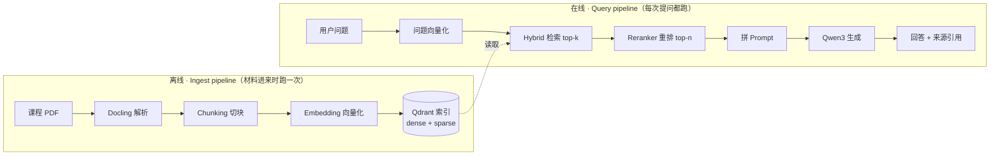
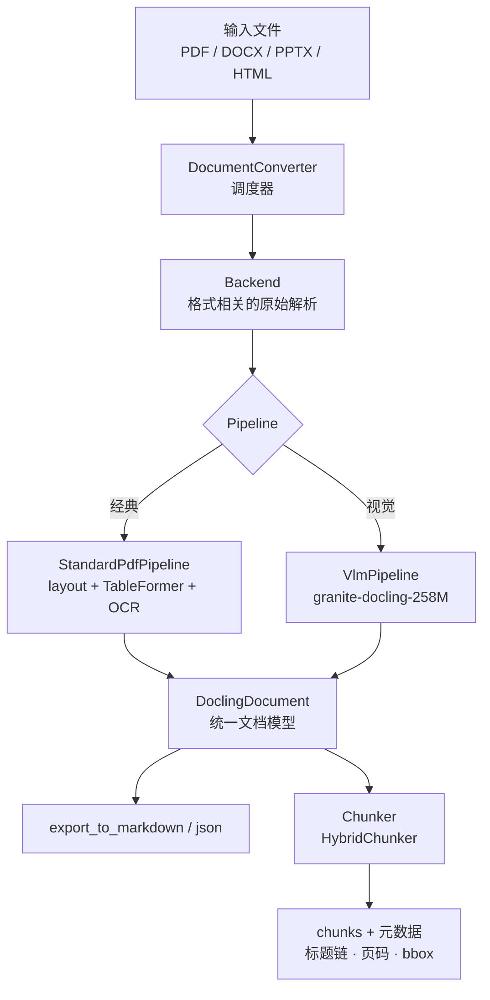
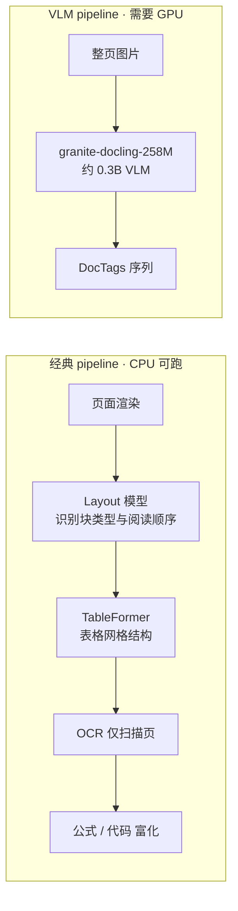
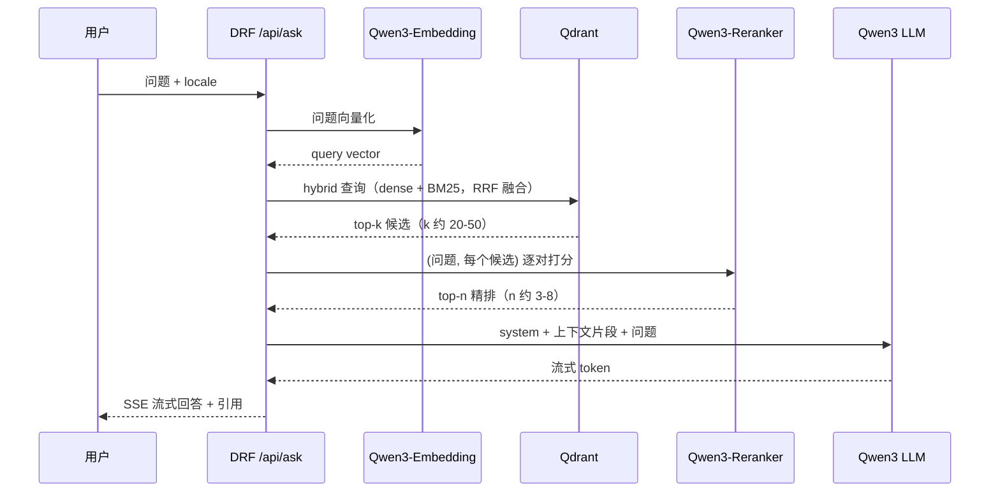
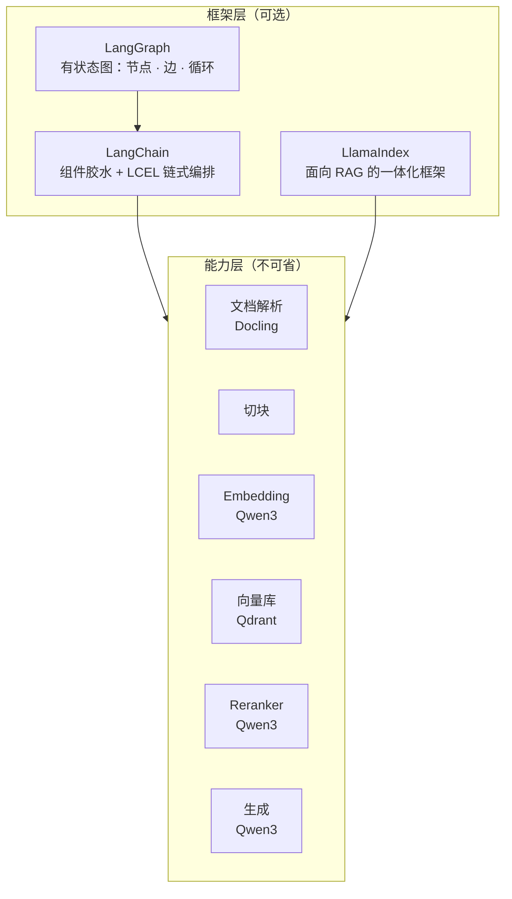

# Docling 与 RAG Pipeline — 原理笔记

面向开发前的概念梳理。决策结论不在这里（属主是 [architettura.md](architettura.md)），路线对比不在这里（属主是 [analisi-rag.md](analisi-rag.md)）。本文只回答：**每个环节在干什么、为什么需要它、本项目怎么落。**

## 1. 全景：RAG 是两条 pipeline，不是一条

初学最容易糊涂的点：「RAG pipeline」这个词被用来指两件不同的事。它们运行时机不同、失败方式不同、评估方式也不同。



三条心法：

- **Ingest 的错误会被永久固化。** PDF 解析把 `perché` 读成 `perche`、把两栏读成一栏，之后再强的 LLM 也救不回来 —— 索引里就是错的。所以 M1 最小实验先验证解析质量，顺序不能反。
- **在线部分是线性流水线。** 没有循环、没有条件跳转、没有「模型自己决定下一步」。这一点直接决定了第 5 节的框架取舍。
- **LLM 是最后一步，也是最不重要的一步。** 检索没召回正确片段，生成阶段只能编。论文里 M3 的 RAGAS 指标之所以要分开测 *context precision/recall*（检索）和 *faithfulness*（生成），就是为了把锅分清楚。

## 2. Docling：把 PDF 变成结构化文档

### 2.1 它解决什么问题

PDF 不是文档格式，是**打印指令格式**。文件里存的是「在坐标 (x, y) 用某字体画字符 e」，没有「这是标题」「这是表格第 2 行第 3 列」「这一栏读完读右边那栏」的概念。`pypdf` 之类的库抽出来的文本，多栏 slide 会左右交错，表格会塌成一行乱码，公式会碎掉。

Docling 做的是**文档理解**：还原版面结构、阅读顺序、表格网格、公式、图片标题，输出一个带层级的对象树 `DoclingDocument`。

### 2.2 架构



五个角色分清楚就不会乱：

| 角色 | 职责 | 会碰到的类 |
| --- | --- | --- |
| DocumentConverter | 入口调度：按格式选 backend 和 pipeline | `DocumentConverter` |
| Backend | 格式相关的原始解析（PDF 页面、字符、图元） | 自动选，一般不碰 |
| Pipeline | 编排模型推理，产出结构 | `StandardPdfPipeline` / `VlmPipeline` |
| DoclingDocument | **统一文档模型**，下游一切的唯一源 | `.document` |
| Chunker / Serializer | 切块喂给 embedding；或导出 Markdown/JSON | `HybridChunker` |

关键点：**`DoclingDocument` 是中间表示**。不管前面走哪条 pipeline、输入是 PDF 还是 PPTX，下游代码只面对同一个对象 → ingest 代码写一次，换 pipeline 只改配置。这正是要在 M1 做 A/B 对比却不用写两套代码的原因。

### 2.3 两条 pipeline



| 维度 | 经典 pipeline | VlmPipeline（granite-docling） |
| --- | --- | --- |
| 原理 | 多个专用小模型串联，每步职责单一 | 一个视觉语言模型端到端「看图写标记」 |
| 算力 | CPU 可跑，本地笔记本够用 | 实际要 GPU；老卡有 bfloat16 限制（含 Colab T4） |
| 数字版 PDF | 已经很稳，是默认选择 | 未必更好，且慢 |
| 扫描件 / 复杂版面 | 依赖 OCR 质量，易错 | 强项 |
| 可调试性 | 每步中间产物可看，出错能定位到具体模型 | 黑盒；错了只能换提示或换模型 |
| 失败模式 | 结构错（栏序、表格边界） | 幻觉（生成原文里没有的内容） |
| 语言覆盖 | OCR 引擎决定 | 英语为主，日/阿/中标为实验性，**意大利语未声明** |

方向：**数字版 slide 走经典 pipeline，VLM 作为对照与扫描件兜底**。这跟 remote-first 的算力策略一致 —— 经典 pipeline 是纯 CPU，本地迭代快，不占共享 GPU。

### 2.4 DocTags：为什么不直接输出 Markdown

granite-docling 不吐 Markdown，吐 **DocTags** —— 一种保留版面语义的标记语言。原因：Markdown 是**有损**的。Markdown 表达不了「这个标题在第 2 页、坐标 (120, 340)」，也表达不了合并单元格的表格。而 RAG 恰恰需要这些：

- **引用溯源**：回答里要给出「来源：第 12 页」，需要 provenance。
- **表格**：DocTags 用 OTSL 编码表格结构，能表达跨行跨列；Markdown 表格做不到。
- **公式**：输出 LaTeX；代码块保留语言。

所以链路是 `DocTags → DoclingDocument → 按需导出 Markdown`。Markdown 是最终展示格式，不是中间格式。中间格式必须无损，这是通用原则。

### 2.5 Chunking：Docling 也管切块

LLM 上下文有限，且检索粒度不能是「整份 PDF」。切块策略直接决定检索质量。

- **HierarchicalChunker**：按文档结构切，一个元素一个 chunk（列表项会合并），自动带上所属标题链和图表标题。
- **HybridChunker**：在前者基础上加 **tokenizer 感知**的两遍精修 —— 先把超长 chunk 按 token 数切开，再把共享同一标题链的过短相邻 chunk 合并。**本项目用这个。**

两个必须理解的细节：

1. **tokenizer 要跟 embedding 模型对齐。** HybridChunker 接收传入的 tokenizer；传错了，切出来的块会超出 Qwen3-Embedding 的输入上限而被静默截断 —— 尾部内容永远检索不到，且不报错。这是最阴险的一类 bug。
2. **`contextualize()`**：返回「元数据富化后的」chunk 文本，即 `标题链 + 正文`。为什么重要：slide 上一句孤立的 `Complessità: O(n log n)` 毫无检索价值，加上标题链 `Algoritmi di ordinamento > Merge sort > Analisi` 之后，语义向量才落在对的位置。**永远用 `contextualize()` 的输出去做 embedding，不要用裸文本。**

每个 chunk 自带的元数据（标题链、页码、bbox、表格上下文）直接决定了前端能不能做「点击引用跳到原 slide 第几页」。

### 2.6 代码形状

```python
from docling.document_converter import DocumentConverter
from docling.chunking import HybridChunker

doc = DocumentConverter().convert("slides.pdf").document   # -> DoclingDocument
chunker = HybridChunker(tokenizer=embedding_tokenizer)     # aligned with Qwen3-Embedding
for chunk in chunker.chunk(doc):
    text = chunker.contextualize(chunk)   # heading path + body -> embedding input
    meta = chunk.meta                     # page / headings / provenance -> payload
```

命令行快速试：`docling slides.pdf`（经典）· `docling --pipeline vlm --vlm-model granite_docling slides.pdf`（VLM）。M1 最小实验就是这两条命令跑同一份课程 PDF 然后对比。

### 2.7 要盯的验证点

意大利语课程 slide 的具体风险，按优先级：

1. **重音字符**：`à è é ì ò ù` 会不会变成乱码或被拆开 —— 一旦坏掉，BM25 精确匹配全废。
2. **多栏阅读顺序**：slide 常见两栏，顺序错了会把不相干的两句粘成一个 chunk。
3. **公式与符号**：课程材料的核心内容。
4. **表格**：单元格边界、合并单元格。
5. **页眉页脚重复文本**：每页都有的课程名会污染每个 chunk。

## 3. Ingest pipeline 逐步

| 步骤 | 干什么 | 关键选择 | 出错的表现 |
| --- | --- | --- | --- |
| 1. Parse | PDF → DoclingDocument | 经典 vs VLM pipeline | 乱码、栏序错、表格塌 |
| 2. Chunk | 文档 → 带元数据的块 | HybridChunker + 对齐的 tokenizer | 块太大被截断 / 太小丢上下文 |
| 3. Contextualize | 块 → 富化文本 | 标题链前缀 | 短块检索不到 |
| 4. Embed | 文本 → 稠密向量 | Qwen3-Embedding 尺寸（0.6B/4B/8B） | 跨语言对不齐 |
| 5. Index | 向量 + 原文 + payload 入库 | Qdrant，dense + sparse 双命名向量 | 过滤字段缺失 |

payload 里从第一天就要带的字段：`locale`（多语言域的硬要求，见 CLAUDE.md）、`course`、`source_file`、`page`、`heading_path`。补数据比一开始就写进去贵得多。

## 4. Query pipeline 逐步



四个必须分清的概念：

- **Dense（稠密）检索**：文本 → 向量 → 比余弦相似度。匹配的是**语义**，所以 `sorting algorithm` 能命中 `algoritmi di ordinamento` —— 这就是跨语言能力的来源，query 和材料**都不需要翻译**。弱点：精确的专有名词、缩写、代码标识符容易漏。
- **Sparse（稀疏）/ BM25**：词频统计，匹配的是**字面词**。弱点正好互补：跨语言结构性失效（英文问题与意大利语材料词汇零重叠）。
- **Hybrid + RRF**：两路各自检索，用 Reciprocal Rank Fusion 按**排名**（不是分数 —— 两路分数量纲不同没法直接比）融合。Qdrant 原生支持，一次查询搞定。
- **Rerank**：检索用的是 **bi-encoder**（问题和文档分别编码，可以预先算好 → 快，但两者从未「见过」对方）；reranker 是 **cross-encoder**（问题和文档拼在一起进模型 → 准，但每对都要现算 → 慢）。所以是两段式：检索粗筛几十个 → 重排精选几个。这不是可选优化，是质量的主要来源之一。

**Top-k 的取舍**：k 太小召回不到；k 太大 → 上下文塞满噪音，LLM 反而被带偏（"lost in the middle"），且延迟和显存都涨。k 是 M3 要调的实验变量，不是拍脑袋的常量。

## 5. LangChain / LangGraph / LlamaIndex：是什么，为什么本项目不用

### 5.1 它们各自是什么



- **LangChain**：一层**适配器 + 胶水**。给上百种 loader、splitter、vectorstore、LLM provider 统一接口，再用 LCEL（`prompt | llm | parser`）把它们串成链。卖点是换组件只改一行。
- **LangGraph**：LangChain 团队做的**有状态图编排**。把工作流建成图：节点是函数，边是转移，共享一个 state 对象，**支持条件分支、循环、人工介入、断点续跑**。它解决的是「模型自己决定下一步做什么」这类控制流。
- **LlamaIndex**：更聚焦 RAG 的框架，索引/检索/查询引擎抽象成型，开箱即用程度最高（也有 Docling reader）。

注意：**这三个都不提供任何新能力**。解析还是 Docling、向量还是 Qwen3、库还是 Qdrant。它们提供的是**编排和统一接口**。

### 5.2 为什么自建

决策已定（属主见 [architettura.md](architettura.md)：自建 pipeline，不用 LlamaIndex/LangGraph 全家桶），理由在这里展开：

1. **控制流根本不需要图。** 第 1 节和第 4 节画的是**线性流程**：解析→切块→向量化→索引，检索→重排→生成。没有循环、没有条件跳转、没有 agent 自主决策。LangGraph 是为循环和分支设计的，用在直线流程上是纯粹的抽象税。
2. **论文要测量的东西，正是框架藏起来的东西。** 实验网格是 embedding 尺寸 × reranker 尺寸 × LLM 尺寸 × top-k × chunk 策略。这些参数在自己的代码里是显式变量；在框架里散落在各层默认值中，而且框架会悄悄改 prompt 模板、悄悄加重试 —— 实验就不可复现了。
3. **可解释性 = 论文的可写性。** 答辩要讲清楚每一步在做什么。「调了 `VectorStoreIndex.as_query_engine()`」不构成一个章节；「实现了 RRF 融合并对比了 k=10/30/50」才是。
4. **代码量并没有省多少。** 这条 pipeline 自己写量级在几百行，且每一行都懂。框架省的是「接 20 种向量库」的适配成本，而本项目只接一种。
5. **依赖风险。** LangChain 的 API 迭代激进，论文周期内的 breaking change 是纯损耗。

### 5.3 什么时候框架才真正划算

诚实地说，下面这些场景自建就是重复造轮子：

- 需要接十几种数据源 / 多个 LLM provider 并随时切换。
- **真正的 agentic 工作流**：LLM 决定是否检索、改写 query、评估片段够不够、不够就再检索一轮 —— 这是带循环和条件的状态机，LangGraph 的主场。
- 需要断点续跑、人工审核介入、多 agent 协作。

对应到本项目：第三点不需要；第二点是 M7 的可选扩展方向（[analisi-rag.md](analisi-rag.md) 已把 web fallback 判为出域）。**真到那一步再引入 LangGraph 也不迟 —— 自建的线性 pipeline 可以整体变成图里的一个节点，不需要重写。** 这是先自建的另一个好处：不锁死。

### 5.4 概念对照表（框架术语 ↔ 本项目做法）

| 框架术语 | 本项目对应 |
| --- | --- |
| `DocumentLoader` | `DocumentConverter().convert()` |
| `TextSplitter` | `HybridChunker` |
| `Embeddings` | Qwen3-Embedding，经 vLLM 的 OpenAI 兼容端点 |
| `VectorStore` / `Retriever` | `qdrant-client`（本地模式 → Docker） |
| `Chain` / LCEL | 一个普通 Python 函数 |
| `Graph` / `StateGraph` | 用不上（无循环无分支） |
| `Callbacks` / tracing | Langfuse 直接接 |

懂这些术语仍然必要：读别人的教程、写论文相关工作章节、答辩被问到「为什么不用 LangChain」，都需要能准确说出它们是什么。**不用 ≠ 不懂。**

## 6. 术语速查

| 术语 | 一句话 |
| --- | --- |
| Chunk | 检索的最小单位；一段带元数据的文本 |
| Embedding | 文本 → 定长向量，语义相近则向量相近 |
| Dense / Sparse | 语义向量检索 / BM25 词频检索 |
| Hybrid + RRF | 两路检索按排名融合 |
| Bi-encoder | 分别编码，可预计算，快 → 用于检索 |
| Cross-encoder | 拼一起编码，准但慢 → 用于重排 |
| Top-k / top-n | 检索候选数 / 重排后进 prompt 的数量 |
| DocTags | granite-docling 的无损版面标记语言 |
| OTSL | DocTags 里的表格结构编码 |
| Provenance | chunk 在原文的位置（页码、bbox）→ 引用溯源 |
| Grounding / Faithfulness | 回答是否真的由检索片段支撑，不是编的 |
| Agentic RAG | LLM 自己编排检索（带循环 / 分支） |

## 7. 落到 M2

| Pipeline 步骤 | 模块职责 | 实验变量（M3 要调的） |
| --- | --- | --- |
| Parse | PDF → DoclingDocument | 经典 vs VLM pipeline |
| Chunk | 切块 + contextualize | chunk 大小、是否富化 |
| Embed | 文本 → 向量 | Qwen3-Embedding 0.6B / 4B / 8B |
| Index | 写入 Qdrant | hybrid 融合、量化 |
| Retrieve + Rerank | 查询 + 精排 | top-k、reranker 尺寸 |
| Generate | 拼 prompt + 调 LLM | LLM 尺寸、prompt 模板 |

模块划分只是职责示意，实际目录结构在 M2 实现时确定（规则见 CLAUDE.md：未定前不建「顺手」目录）。

最短路径：一份真实课程 PDF → `docling` 两条 pipeline 各跑一遍 → 人眼比对意大利语 Markdown（重音、公式、栏序、表格）→ 选定 pipeline 后再往下接 chunking。**先验证解析，再谈检索。**
