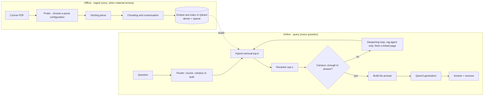
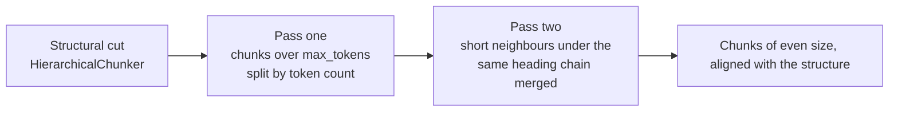

# Docling and the RAG pipeline

How the ingest and query pipelines work: what each step does, why it is needed and how this project does it. This file owns the parsing routing rules, the chunk payload contract (section 3.6) and the retrieval and generation rules (section 4.1). Decisions and their reasons are [decisions.md](decisions.md), the route comparison is [rag-analysis.md](rag-analysis.md), and every count and timing is [experiment-log.md](experiment-log.md).

## 1. The big picture: RAG is two pipelines, not one

"The RAG pipeline" names two different things, which run at different times, fail in different ways and are evaluated differently:



Three principles:

- **Ingest errors become permanent.** A parse that reads two columns as one or garbles `perché` cannot be rescued by any LLM later — the index itself is wrong. Parsing quality is checked first; the order cannot be reversed.
- **The query side is small, explicit control flow**: a router, retrieval and generation; for the campus source the command-line agent adds a deepening loop of at most three fetches (`route()` and `deepen()` in `rag/agent.py`; the state machine is [unifi-web-source.md](unifi-web-source.md)). The web API does not run the loop (`apps/qa/engine.py`); its web path is 🔜 M5 `#34`. Why no framework: [rag-analysis.md](rag-analysis.md).
- **The LLM is the last and least important step.** If retrieval misses the right excerpt, generation can only invent. RAGAS measures *context precision/recall* (retrieval) and *faithfulness* (generation) separately so that the blame lands in the right place (🔜 M3 `#20`).

## 2. Steps 0–1 · probe and parse

✅ `rag/probe.py`, `rag/parse.py`.

### 2.1 What Docling solves

A PDF is not a document format but a **printing format**: the file says "draw this character at (x, y) in this font", not "this is a heading, a table, read the left column first". `pypdf` extracts text with columns interleaved, tables collapsed and words run together. Docling does **document understanding**: it restores layout, reading order, table grids and formulas, and outputs a hierarchical object tree, the `DoclingDocument`.

**`DoclingDocument` is the one intermediate representation**: whichever pipeline and input format, everything downstream sees the same object, so the ingest code is written once and changing pipelines is configuration. The intermediate format has to be lossless — Markdown cannot express page numbers, coordinates or merged cells, which source citations need — and Markdown is only a display format.

### 2.2 The two pipelines

| Dimension | Classic pipeline | VlmPipeline (granite-docling 258M) |
| --- | --- | --- |
| How it works | several specialised small models in sequence (layout, TableFormer, OCR, enrichment) | one vision-language model that "reads the image and writes the markup" end to end |
| Compute | runs on CPU, enough locally | autoregressive, token by token: slow even on GPU |
| Born-digital PDFs | reliable, the default | not necessarily better, and slow |
| Debugging | every intermediate result can be inspected | a black box |
| Failure mode | structural errors (column order, table borders) | hallucination (content that is not in the source) |

Speeds are in [experiment-log.md](experiment-log.md), entry of 2026-08-02. Conclusion (section 2.5): **born-digital slides take the classic pipeline; the VLM is kept for comparison and scans, automatic routing never chooses it**, and it is reachable only by hand with `--profile manual --pipeline vlm`.

### 2.3 Parsing quality checks

Checked on the PPM corpus (the corpus's qualitative facts are [architecture.md](architecture.md), its counts [experiment-log.md](experiment-log.md), entries of 2026-07-31 and 2026-08-02):

| Check | Result |
| --- | --- |
| Word spacing | ✅ restored: `pypdf`'s `"Video isa sequenceof frames"` becomes `"Video is a sequence of frames"`, which BM25 can use (`rag/parse.py`) |
| Ligatures (fi, fl) | ✅ `normalize_text()` in `rag/parse.py` applies NFKC; none survive |
| Accented characters | ✅ `più`, `è`, `ambiguità` come through, so Italian BM25 works (`rag/parse.py`) |
| Tables | ✅ restored as real markdown tables with correct borders (`rag/parse.py`) |
| Heading levels | ✅ `##` levels are recognised, so chunking has a heading chain to use (`rag/chunk.py`) |
| HTML tag escaping | 🔶 inconsistent: `&lt;div&gt;` in body text, a bare `<header>` inside tables; a search for `<nav>` may suffer, and no measurement covers its effect on retrieval |
| Formulas | 🔶 with enrichment off they are **dropped silently**; with it on they come out as `$$` LaTeX with correct values (measured on `2.1`), and routing turns it on where the fonts call for it (`rag/probe.py`). Matrices drawn with Symbol-font braces are detected as tables and skip enrichment |
| Images | 🔶 every image becomes a `<!-- image -->` placeholder, so **dead chunks are the corpus's largest retrieval gap** (section 2.5); picture description is 🔜 M3 `#28` |

### 2.4 Adaptive routing: who decides each file's configuration

The enrichment switches (OCR, formulas) are off by default, but **a switch left off where it was needed loses content for good**; turning everything on makes the text-only decks pay many times the compute; letting the user choose pushes onto them a question they cannot answer. Production pipelines (unstructured.io `strategy="auto"`, Azure Document Intelligence, Textract; outside the repository) share one structure: **probe at zero cost, then route on the signals**. `rag/probe.py` loads no model and renders no page; it reads four signals from the PDF structure — text per page, share of empty pages, image objects, the font table.

| Condition | Decision | Why |
| --- | --- | --- |
| `empty_page_ratio > NEEDS_VISION_RATIO` (0.3), a page being empty below `EMPTY_PAGE_CHARS` (50) | `ocr = True` | the text layer is largely missing, and only the rendered page can restore it. **Not the VLM** (section 2.5) |
| the font table contains a name from `MATH_FONT_HINTS` (`Symbol`, `CMMI`, `CMEX`, `CMSY`, `MTSY`, `MathematicalPi`, `Cambria Math`, `STIX`) | `formula = True` | maths fonts carry glyphs that text fonts lack |
| otherwise (an intact text layer) | the classic pipeline alone, OCR off | OCR produces the same output and costs more time |

The resulting distribution over the corpus is [experiment-log.md](experiment-log.md), entry of 2026-08-02, section 1. Three design points:

- **The thresholds are this corpus's measured values**, not general truths; another corpus needs them measured again.
- **The maths-font test over-triggers on purpose** (PowerPoint also draws bullets with `SymbolMT`): the formula model gates itself per formula region, so a false positive costs one model load, while a false negative loses the formula for good — asymmetric costs, asymmetric threshold.
- **There is no parse-quality score in the code.** Re-parsing a file whose result scores low is 🔜 M3 `#30`, and its threshold has to be tuned on the gold set rather than guessed.

### 2.5 What the measurements taught

Each lesson's numbers are in [experiment-log.md](experiment-log.md), entries of 2026-07-31 and 2026-08-02.

- **OCR on a PDF that has a text layer is waste**: the same output for more time, so `do_ocr` is off by default in `rag/parse.py`, against Docling's own default. The exception is the image-based deck, where OCR doubles the extracted text.
- **The VLM loses to OCR where RAG cares most**: on the image-based deck it takes twice as long and produces more characters but fewer distinct words, losing technical literals such as `avc1.42e01e`, `autoplay` and `codecs` for narrative words. **The VLM paraphrases, OCR transcribes**, and BM25 lives on literal tokens. It does not rescue the dead sections either. Hence an empty-page ratio above the threshold routes to `classic + ocr`, not to the VLM.
- **Formula placeholders underestimate the loss**: with enrichment off, some formulas leave no placeholder at all, so the loss can only be judged by running the enrichment once and comparing. VLM-generated LaTeX has trustworthy values but hallucinated symbols.
- **Dead chunks**: sections whose only content under the heading is `<!-- image -->` — and they are the course's core, such as `Django's ORM`, `CRUD examples`, `Components of a Database`. A student asking how Django's ORM works finds an empty chunk in the index. They are the denominator of the picture-description ablation (`#28`).
- **Batch vision and generation work belongs on the server**: the VLM and picture description generate autoregressively, a local GPU fed one page at a time is latency-bound, and the one lever that works is batching — vLLM's continuous batching on MICC. Locally only single-document comparisons run.
- **One switch, two defaults, on purpose**: formula enrichment is off by default in the `rag/parse.py` command line (each run would pay the model download and load again), and on in the resident Celery worker (loaded once, then gating itself per item at almost no cost; 🔜 M5 `#34`).

## 3. Step 2 · chunking

✅ `rag/chunk.py`.

### 3.1 Why split into chunks

Two hard constraints: the embedding model's input has a limit, so a whole PDF does not fit; and retrieval cannot work at the granularity of a document — a student asks a precise question, and what should match is the few slides about it, not three PDFs of the corpus. A chunk is **the smallest unit of retrieval**: a piece of text with metadata.

How the text is cut decides retrieval quality, and both directions fail: **chunks too large** are truncated at the embedding input, or drag unrelated content into the prompt; **chunks too small** lose their context, and the vector lands in the wrong semantic place.

### 3.2 How HybridChunker cuts

Docling ships two chunkers:

- **HierarchicalChunker** cuts by document structure — one element (paragraph, list, table) per chunk, with its heading chain recorded. On slides, elements vary wildly in length, producing many fragments and some overlong chunks.
- **HybridChunker** (used here) adds two **tokenizer-aware** passes on top of the structural cut:



The result: chunk borders fall on structural borders wherever possible (no table cut in half, no chunk across chapters), and sizes stay close to the embedding model's limit.

### 3.3 The tokenizer must match the embedding model

The tokenizer HybridChunker counts with is **a parameter**. Pass the wrong one (count with GPT's tokenizer, encode with Qwen's model) and the two sides count the same text differently: the chunker believes a chunk fits, the embedding model truncates it — **the tail is cut silently, is never retrieved, and nothing reports it**. Implementation: the tokenizer of `Qwen/Qwen3-Embedding-0.6B` wrapped in `HuggingFaceTokenizer` (`DEFAULT_TOKENIZER`); the limit is 512 tokens by default (`DEFAULT_MAX_TOKENS`, CLI `--max-tokens`) — a retrieval granularity, not Qwen3-Embedding's 32k input limit. Choosing it by measurement is 🔜 M3 `#31`.

### 3.4 contextualize(): heading chain plus body is the embedding input

A lone `Complessità: O(n log n)` on a slide is useless to retrieval — the vector does not know which algorithm it is about. `chunker.contextualize(chunk)` returns the heading chain plus the body:

```text
Algoritmi di ordinamento > Merge sort > Analisi
Complessità: O(n log n)
```

Only then does the vector land in the right place. **Rule: dense embedding always takes the output of `contextualize()`, never the bare text.**

### 3.5 The handoff: HybridChunker takes a DoclingDocument, not Markdown

The chunker needs **the object tree with its hierarchy and page numbers** (heading chains and provenance live there; Markdown cannot express them). So `rag/parse.py` writes two files per document: `data/parsed/<name>.<variant>.json` (`save_as_json`, lossless, the only input of chunking) and `<name>.<variant>.meta.json` (a provenance sidecar: `source_sha256`, `parse_variant`, `docling_version`, `course` and more). The chunk step reads these two files only — never the PDF, never the converter, never a hash computed again — so a full reparse (about 15 minutes for the corpus: [experiment-log.md](experiment-log.md), entry of 2026-08-21) is paid once per parse configuration. Why JSON and not Markdown: [decisions.md](decisions.md), 2026-08-04, *Parsed documents are kept as lossless JSON, not Markdown*.

### 3.6 The chunk payload contract

The fields every chunk carries into the index, **from the first day**: a field added later costs a rewrite of the stored points that keeps their vectors, no GPU, as step ④ of the migration order in [data-model.md](data-model.md) does, or a reindex. The contract model is `Chunk` in `rag/chunk.py`; the output is `data/chunks/<name>.<variant>.jsonl`, one chunk per line:

| Field | Meaning |
| --- | --- |
| `chunk_id` | slides: `course:academic_year:first 16 hex of sha256:variant:index`, prefixed with the edition (`rag/chunk.py`, `chunk_id_of`); web: `first 16 hex of sha256:variant:index`, unchanged. Deterministic — the same edition, corpus snapshot and parse configuration give the same ids, so rebuilding the index overwrites instead of duplicating, and two editions of the same PDF get disjoint id sets |
| `chunk_index` | position in the document |
| `text` | the raw chunk text, NFKC — the sparse (BM25) side, and what the user is shown |
| `embed_text` | the output of `contextualize()` (after heading filtering), NFKC — **the dense side only** |
| `locale` | a BCP-47 primary subtag (2–3 lowercase letters, checked by a pydantic pattern). Precedence: CLI `--locale` > sidecar `lang` (for web, `<html lang>`) > heuristic (CJK characters ≥ 20% → `zh`, otherwise a majority vote of Italian and English stopwords, a tie going to `en`) |
| `course` · `source_file` | from the sidecar. For slides: `course` is a UniFi course code, `Course.code` (e.g. `B028451`); for web: `course` is the site-section slug (e.g. `ingegneria`), or `"web"` when the registry row has none (`rag/webparse.py`); `source_file` is the snapshot artefact name (a hash of the URL plus the extension — URL basenames collide across a site (`index.html`), hashes do not; the URL itself is in `url`) |
| `academic_year` | slides: the course edition's academic year (e.g. `2025-2026`), joining `course` as the edition key; web: null. Slides rows written before `#96` are null too, and reachable only with `scope=None` |
| `page` | 1-based, the first page of the chunk's first item — the anchor of a citation such as "p. 12". For web: PDF attachments carry real pages, HTML chunks carry `1` (`rag/chunk.py` takes the first page, or 1 when there is none); a web hit is scored by `urls`, not by page |
| `pages` | every page the chunk spans (when a merge crosses slides, `page` stays the start and `pages` keeps the truth); for HTML chunks, `[]` |
| `heading_path` | the filtered heading chain, possibly empty |
| `parse_variant` · `docling_version` · `source_sha256` | provenance: the M3 ablations have to attribute each chunk to a parse configuration and a corpus snapshot — the same argument as `locale`. For web: `parse_variant` is `"html"` (PDF attachments keep their real variant, `classic`), `source_sha256` is the hash of the raw HTML or PDF bytes |
| `kind` | the discriminator `"slides"` \| `"web"`, `slides` by default — so payloads in the index and the slides path needed no change |
| `url` · `referrer_url` | web provenance (null for slides, a legal final state): `url` is the page's or attachment's own address (cited to the student), `referrer_url` the page that linked it, recorded for every web row that has one |
| `fetch_date` · `section` | the fetch date (the second half of the citation marker `[<url> · <fetch_date>]`) and the site section |
| `ingest_run_id` · `ingest_source` · `trigger` | snapshot identity: which run, `"crawl"` (a crawl) or `"live"` (a fetch a student's question triggered), and what triggered it. Evaluation reads `crawl` by default (the eval-isolation rule, [architecture.md](architecture.md)) |
| `content_hash` | the page content hash, for the incremental check (parse and index again only when it changes) |

**Replacing web chunks**: `chunk_id` changes with `content_hash` (new content, new ids), and the replacement unit is the **(url, ingest_source) pair** — after the upsert, the pair's other points are deleted, so a crawl snapshot and live increments **never overwrite each other**. The snapshot and registry layout and the deepening loop are [unifi-web-source.md](unifi-web-source.md).

**Replacing slides chunks** is by source file within an edition, owned by [data-model.md](data-model.md), section on the contract between `apps/` and `rag/`.

NFKC normalisation (`normalize_text` in `rag/parse.py`) is applied to `text` and `embed_text` **at this step**: the document JSON keeps the original, and the index sees only the folded text.

### 3.7 Heading pollution

A repeated page header is recognised as a heading (`HTML &amp; CSS`, on most pages of `3.5-HTML5-Part-2` whichever parser reads it: [experiment-log.md](experiment-log.md), entry of 2026-08-02, section 2). If every chunk's `contextualize()` prefix is the same heading chain, dense retrieval degrades — every vector is pulled in the same direction. Two measures, both ✅ in `rag/chunk.py`:

- **Page furniture removed**: a heading that appears on at least `max(5, 20% of the pages)` distinct pages is a header (`furniture_threshold()`; the margin is wide on both sides), and it is removed from the chunk metadata before `contextualize()` — it leaves `heading_path` and `embed_text` together, and the document structure is untouched.
- **The heading chain goes to the dense side only**: `text` (bare body, the BM25 side) and `embed_text` (with the heading chain, the dense side) are stored apart (section 3.6).

### 3.8 The ingest steps at a glance

| Step | Status | What it does | Key choice | What going wrong looks like |
| --- | --- | --- | --- | --- |
| 0. Probe | ✅ `rag/probe.py` | PDF → profile → parse configuration | signals and thresholds (section 2.4) | an enrichment left off → content lost for good |
| 1. Parse | ✅ `rag/parse.py` | PDF → DoclingDocument JSON | classic against VLM | garbled text, wrong column order, collapsed tables |
| 2. Chunk | ✅ `rag/chunk.py` | document → chunks with payload, contextualized | HybridChunker with a matching tokenizer; heading chain with furniture removed (section 3.7) | chunks truncated when too large, context lost when too small |
| 3. Index | ✅ `rag/index.py` | text → dense vectors; vectors, text and payload into Qdrant | Qwen3-Embedding-0.6B locally, `embed_text` to dense and `text` to sparse; Qdrant with two named vectors (dense, and sparse fastembed BM25 with the IDF modifier); idempotent upsert by `uuid5(chunk_id)` | filter fields missing; languages misaligned across the dense space |

## 4. The query pipeline step by step

```mermaid
sequenceDiagram
    participant U as User
    participant API as DRF /api/ask
    participant LLM as Qwen3 LLM
    participant E as Qwen3-Embedding
    participant Q as Qdrant
    participant R as Qwen3-Reranker
    U->>API: question, conversation id, optional locale
    Note over API: the conversation's history is loaded on the server
    API->>LLM: route: course, campus or both; rewritten query
    LLM-->>API: RouteDecision
    API->>E: encode the query
    E-->>API: query vector
    API->>Q: hybrid query (dense + BM25, RRF fusion) per collection
    Q-->>API: top-k candidates
    API->>R: score (question, candidate) pairs
    R-->>API: top-n
    Note over API: only rag.agent on the command line deepens here; /api/ask does not
    API-->>U: SSE start: locale, route, sources
    API->>LLM: system + excerpts + question
    LLM-->>API: streamed tokens
    API-->>U: SSE tokens, then end
```

Four concepts to keep apart:

- **Dense retrieval**: text → vector → cosine similarity. It matches **meaning**: `sorting algorithm` finds `algoritmi di ordinamento` — the source of the cross-language capability, with neither query nor material translated. Weak on exact names, abbreviations and code identifiers.
- **Sparse / BM25**: term statistics, matching **literal words**. Its weakness is the mirror image: across languages it fails by construction.
- **Hybrid + RRF**: both branches retrieve on their own, and Reciprocal Rank Fusion merges them by **rank** (their scores have different scales). Qdrant supports it natively.
- **Rerank**: retrieval is a bi-encoder (query and document encoded separately, precomputable — fast but coarse); a reranker is a cross-encoder (question and document read together — accurate but slow). Two stages: retrieval narrows to dozens, reranking picks a few. It is not an optional optimisation but one of the main sources of quality.

**Choosing top-k**: too small and the answer is not recalled; too large and the context fills with noise ("lost in the middle"), with latency and memory rising. k is chosen by measurement, 🔜 M3 `#31`.

### 4.1 Retrieval and generation rules

Implemented in `rag/index.py`, `rag/search.py` and `rag/answer.py`:

- **Sparse side** ✅ `rag/index.py`: fastembed's `Qdrant/bm25` (term frequency on the document side, `modifier=IDF` on the collection), stemming with its default English scheme; `text` and `embed_text` are stored apart (section 3.6) so the two inputs do not contaminate each other. Why BM25 and not SPLADE: [decisions.md](decisions.md), 2026-08-04, *Sparse retrieval is fastembed BM25 with an IDF modifier; SPLADE is not pursued*.
- **The fusion trap** ✅ `rag/search.py`: in Qdrant's embedded mode a fusion query **silently ignores a top-level `query_filter`** (measured), so `locale`, the edition scope and ingest filters go inside each `Prefetch` branch.
- **Loading the reranker** ✅ `rag/search.py`: `Qwen/Qwen3-Reranker-0.6B` is a causal LM, and the official recipe scores each (query, document) pair as P("yes") over the two tokens yes and no; wrapping it in a classification head such as CrossEncoder **silently attaches a randomly initialised head** that outputs noise.
- **The answer follows the question's language** ✅ `rag/answer.py`: the language is detected from the question text by default, `--locale` overrides it, and the system prompt states it; checking it at scale is part of the M3 evaluation (🔜 M3 `#20`).
- **Citation markers** ✅ `rag/answer.py` (`source_marker()`): `[source_file p.N]` for slides, `[url · fetch_date]` for web pages; each excerpt in the prompt carries its marker and the model is asked to reuse it. The sources shown to the student are rendered from retrieval metadata, not from the model's text ([decisions.md](decisions.md), 2026-08-21, *The campus source and the agent*, point 6).
- **Refusal** ✅ `rag/answer.py`: with no candidate the LLM is not called, and the answer says the material has nothing — in Italian for an Italian question, in English otherwise; the prompt also asks the model to say so when the excerpts do not support an answer. Whether a refusal was right is a bucket of the error taxonomy (🔜 M3 `#23`).
- **RRF parameters and dense/sparse weights**: Qdrant's RRF defaults and 20 candidates per prefetch branch (`PREFETCH_LIMIT`); choosing them by measurement is 🔜 M3 `#31`.
- **Heading-chain pollution**: section 3.7.

## 5. LangChain / LangGraph / LlamaIndex

Why the pipeline uses none of them, with the mapping from their terms to this project: [rag-analysis.md](rag-analysis.md).
