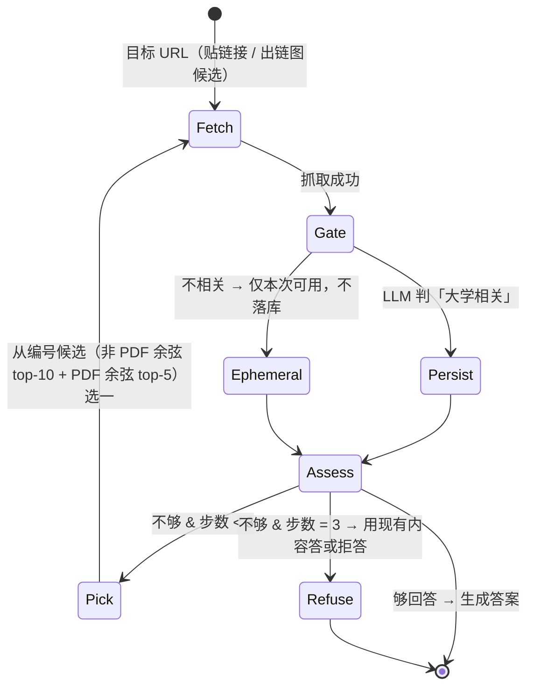

# Fonte web UniFi — 爬取、快照与自增长层

校园信息源（UniFi 网站 → Qdrant `unifi_web` collection）的设计属主：scope 规则、快照与 registry 布局、深化循环。chunk 字段表的属主是 [docling-e-pipeline.md](docling-e-pipeline.md)（§3.6，含 web 侧取值规则与替换粒度）；里程碑清单在 [ROADMAP.md](../ROADMAP.md) M2.5；架构决策（自增长写入门 · eval 隔离 · agent 编排）在 [docs/architettura.md](architettura.md) 决策表。

各节状态随实现逐节标注；自增长验收的完整实测记录（门 18/20 · 双臂 0/7 · 逐题归因）归 [diario-sperimentale.md](diario-sperimentale.md)。

## Scope 规则表

种子爬取用**确定性规则表**（不锁 unifi.it 域——LLM 语义相关性判定只作用于自增长写入，分层理由：500 页逐页过 LLM 不经济）。✅ 实现于 `rag/crawl.py` 的 `DEFAULT_SCOPE`；每行的 path_prefix 必须是真实页面（兼作 link-BFS 种子）：

| 板块（section slug） | 规则 | 状态 |
| --- | --- | --- |
| `ingegneria` | `ingegneria.unifi.it/*`（sitemap.php + link-BFS） | ✅ 首爬 2026-08-22：497 页 + 127 PDF（`data/webcorpus/crawl-20260822-143647`），撞 500 页顶时队列剩 940 |
| `servizi` | `www.unifi.it/it/studia-con-noi*`（报名、学费、segreterie） | ✅ 二爬 2026-08-22：328 页（`data/webcorpus/crawl-20260822-164843`，本轮 3 板块合计 501 页，收队时队列剩 2101） |
| `mobilita` | `www.unifi.it/it/ateneo/nel-mondo*`（Erasmus 与国际流动） | ✅ 二爬 2026-08-22：74 页（同 run） |
| `international` | `www.unifi.it/en/*`（英文版，国际学生入口） | ✅ 二爬 2026-08-22：99 页（同 run） |
| 校外学生刚需域（DSU Toscana、CISIA 等） | 显式条目按需加 | 🔜 查询缺口驱动 |

硬底线（全部路径共用）：robots 遵守 · 1 req/s · `--max-pages` 500 硬顶 · UA 表明论文用途 · PDF 附件 ≤20MB · 只读。附件只收 PDF：Office 后缀（`.doc(x)` `.xls(x)` `.ppt(x)` `.rtf` …）不跟进——首爬实测 46 个全是空白申请表模板，无问答价值；出链图仍记录这些链接。`--sections` 取规则表子集，补爬时把页数配额留给新板块（首爬 ingegneria 一家即打满 500 页）。

## 多 collection 检索

✅ 实现于 `rag/search.py` `search()`（`collections` 参数），gold 按 `GoldQuestion.target` 选库：

- **rerank 路径**：每库各出一个 fusion 候选池（每池 20）→ 合并成一个池 → 统一 rerank 取 top-k。跨库可比性由 reranker 保证（它只看 query×文本）。
- **`--no-rerank` 路径**：RRF 分数**跨库不可比**，不合并——每库各取 top-k，按名次 round-robin 交错后截断到 k（是定义不是融合；长池的余名次补满剩余名额）。
- **ADR-1 作用域**（决策属主 [architettura.md](architettura.md)）：`ingest_source`/`ingest_run_id` 过滤条件只进 `unifi_web` 的两个 prefetch 分支，slides 分支永不携带——slides 非回归门的语义因此不可能漂移。
- 多库合并只发生在 agent 路由 `both`（✅ `rag/agent.py` `collections_for()`）；两个非回归门（slides · campus）恒单库。

快照总量（两轮爬取合计）：**998 页 · 4 板块 · `unifi_web` 29098 点**——这是 eval 隔离与回滚验证反复对照的基线点数。

## 快照与 registry 布局

✅ 实现于 `rag/crawl.py`（快照 + manifest + registry 写入）与 `rag/live.py`（live 行追加）；布局如下：

两个工件，生命周期相反：

```
data/webcorpus/
├── <run_id>/
│   ├── manifest.json          # 不可变：该次 run 抓了哪些 URL + hash（M3 引用的快照身份）
│   ├── <page>.html            # 原始抓取物
│   └── <attachment>.pdf       # 页面直链附件
└── registry.jsonl             # append-only 全局账本，crawl 与 live 都追加
```

`registry.jsonl` 一行一条：`url · content_hash · fetch_date · ingest_run_id · ingest_source("crawl"|"live") · trigger · outlinks[]`（anchor text + URL）。同一 URL 以最后一条为准。三个职责共用：**出链图查询**（自增长候选）、**增量判定**（content_hash 变了才重解析重索引）、**回滚分组**（按 `ingest_run_id` 取 URL 列表 → Qdrant payload filter 删除）。

- 并发/中断语义：论文期单进程写；读取端跳过损坏行并告警；M5 并发语义归 M5。
- 回滚连带：删除某次 live 写入后，同 URL 更早的 crawl 版本**保留**（回到快照态，期望行为）。
- 存放：`data/`（gitignore）内，与语料同风险姿态；备份随 `data/gold` 同批。

## 深化循环

状态机与预算落代码（下方逐项标注真实路径）。自增长验收实测：**双臂（主臂 · `--no-deepen`）均 0/7**，等分证明瓶颈不在跳链而在上游（判定饱和 · 强制选择 · 路由误送 · 门判据范围）；步预算分解墙钟（解析 ≤46.6s · encode 77–117s/页 · 显存峰值 7923 MiB）与逐题归因见 [diario-sperimentale.md](diario-sperimentale.md)。

以「有可以回答的信息」为停止条件的 agent 迭代抓取（原 self-assess 并入「够答？」判定）：



✅ 实现于 `rag/agent.py` `deepen()`（状态机）与 `narrow_candidates()`（候选收窄）；`ask` 入口 `uv run python -m rag.agent "<question>" [--no-deepen]`。

硬上限与预算（全部代码常量，非约定）：≤3 步/题（`DEEPEN_MAX_STEPS`）· 单步墙钟 60s（`rag/live.py` `STEP_TIMEOUT_SECONDS`；超时按「没拿到」继续——该步内容丢弃、不再对未变内容付一次「够答？」判定，直接换下一候选）· **PDF 解析步独立预算 120s**（`rag/live.py` `PDF_PARSE_TIMEOUT_SECONDS`；实测语料最大 PDF 18.4MB 走 CPU classic 40 页顶需 66–69s，压在 60s 步钟内会把恰恰最值得抓的长文档全部判成 PARTIAL_SUCCESS 不可入库）· 单次 LLM 请求 30s（`rag/llm.py` `DEFAULT_TIMEOUT_SECONDS`；SDK 默认 600s + 重试会让任何墙钟预算变成空文，这是步钟下面的硬兜底）· ephemeral 页带入本轮上下文的 chunk 数 ≤5（`rag/agent.py` `EPHEMERAL_CHUNK_LIMIT`，按同一余弦排序取前 5——不在库中，检索排不了它）· live 解析走 CPU + classic 禁 OCR + 页数 ≤40 · live 的 dense encode 走 CPU（`rag/index.py` `(model, device)` 键控懒缓存单实例，**首次加载单独计时不占步预算**——懒加载一次/进程可摊销）· LLM 段间卸载（`OLLAMA_KEEP_ALIVE=0` + 控制流内卸载点）。降级开关 `--no-deepen`：只抓目标页 + 直链 PDF，不跳链接（继承同一余弦排序，**不继承 top-5 截断**——两臂只差「跳链接」单变量，归因才成立）。

**60s 步钟计什么（ADR，与上面几个独立预算配套）**：步钟覆盖**四件事**——「够答？」判定 + 候选选一 + fetch + 相关性门，即全部网络等待与 LLM 等待；**解析与 encode 不计入**，各守自己的预算。

- 判定为什么在里面：上一步在门后卸载了 LLM（`OLLAMA_KEEP_ALIVE=0`），**重载墙钟就落在卸载后的第一次 LLM 调用上**——正常情况是本步的「够答？」判定，上一步超时跳过判定时则是候选选一。重载不计入 = 步预算无法被超出，等于没有预算；计入是设计，不是遗漏。
- 停表落点：`fetch_and_ingest` 的卸载 hook 恰在门给出判定、解析/encode 开工之前触发，`rag/agent.py` `_timed_fetch()` 就用它停表。
- 解析/encode 为什么在外面：实测一页 18 chunk 的 CPU dense encode 需 117s，若计入 60s 步钟，**每一次成功入库都会被判成「没拿到」**，深化循环等于自锁；解析侧同理（66–69s > 60s）。与上面「首次加载单独计时不占步预算」同一条口径：不可摊销的等待计入步钟，可摊销或另有硬预算的重活不计。
- 未到门就结束的抓取（robots 拒绝 / 死链 / 不支持类型）hook 不触发，**全程计入**——那本来就全是网络等待。
- 超时不撤销写入：`rag/live.py` 已落库的页不因步钟作废，循环只是本轮不看它。故循环收尾时若有「已入库但未及重检索」的步，补跑一次检索（零 LLM 成本），否则答案会引用被替换掉的旧版本。

**候选收窄（mini-ADR）**：registry 实测每页非 PDF 出链中位数 79 / p90 138 / max 232（全量 83/143/640），PDF 出链 p90 9 / max 408；「≤10」丢弃约九成链接，所以排序规则必须显式，**禁用 DOM / registry 顺序**——页面靠前的链接是导航。

- 排序串：非 PDF = `anchor_text + url path`；PDF = `anchor_text + 文件名 + url path`（文件名本就在 path 内，重复即加权：法令式 PDF 没有 anchor 句子、path 段也无语义，文件名是它仅有的文本）。
- 打分：排序串经 `rag/index.py` 的 CPU dense encoder 编码，与 `RouteDecision.query` 算余弦；余弦是 `rag/agent.py` 私有纯 Python helper（dot/norm over `list[float]`），**不引 numpy**——非声明依赖，且候选量级下这层开销可忽略（编码开销另守步钟 ADR）。
- 名额：非 PDF top-10 与 PDF top-5 **两个独立配额**，PDF 不挤占非 PDF 名额。理由两侧对称：g001/g002 的唯一 referrer 页各挂 32/40 个法令式 PDF，无条件保留 = 洪水口从出链搬到 PDF；合并配额则让导航链把唯一含答案的附件挤出去。输出为两组合并后按余弦降序的单一编号列表。
- 候选带 referrer：每个候选连同**挂它的那一页 URL** 一起排序、一起交给 `fetch_and_ingest`（`rag/agent.py` `Candidate`），registry 行与 chunk payload 的 `referrer_url` 由此而来——字段属主 [docling-e-pipeline.md](docling-e-pipeline.md) §3.6：web chunk 必须记住附件挂在哪一页，只有 slides 可为空。
- 离线排序质量实测（gold 问题 × 真实 referrer 页）：g001 正解 PDF 名次 **2/32**，top-5 边界分差 **+0.267**；g002 名次 **3/40**，分差 **+0.056**。两题均在 top-5 内，具名 fallback（词法预筛 / GPU 编码窗口 / anchor 向量缓存）无需启用。g002 分差薄 = 已知脆弱点（同页有逐字相同 anchor 的兄弟 PDF，区分信号只在 DOM 分节标题里，`extract_links` 不采集），记为 M3 错误分类法改进候选。

逐题决策日志（M3 错误分类法原料）schema：`run_id · question_id · step · candidates[] · choice · reason · outcome`。✅ `rag/agent.py` `Decision` 模型，append-only 落 `data/webcorpus/decisions.jsonl`（`--decision-log` 可改）。`candidates[]` 落 anchor 原文，否则无法区分「候选没给对」与「模型选错」；`outcome` 取值 `answered · persisted · already indexed · ephemeral · not retrieved · timeout · no candidates · steps exhausted`（`already indexed` = 增量判定认出该页未变、库未增长，与 `persisted` 分开记以便 M3 归因）。

## 兜底行为

出链图无候选且问题未带 URL → 拒答 + 指路：建议去 unifi.it 搜索，并提示「把网址贴给我，我就能学会」（自增长留给贴链接路径）。✅ 实现于 `rag/agent.py` `pointer_line`（it/en/zh 按 locale 出文案），验收跑中 g007/g008 实际触发。
