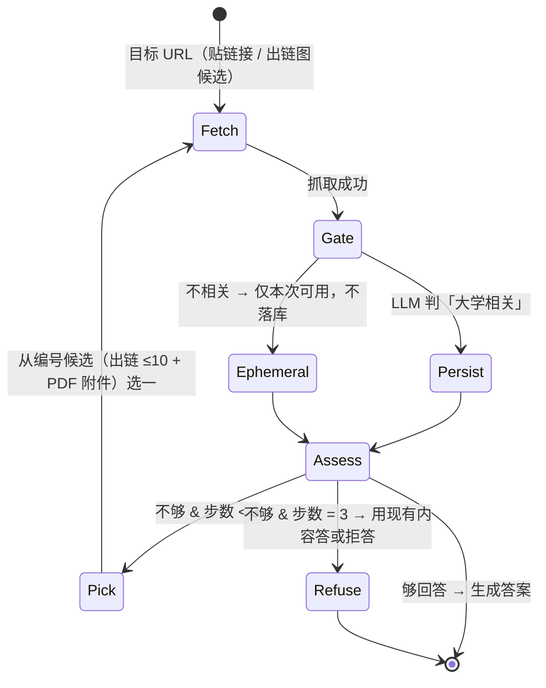

# Fonte web UniFi — 爬取、快照与自增长层

校园信息源（UniFi 网站 → Qdrant `unifi_web` collection）的设计属主：scope 规则、快照与 registry 布局、深化循环。chunk 字段表的属主是 [docling-e-pipeline.md](docling-e-pipeline.md)（§3.6，含 web 侧取值规则与替换粒度）；里程碑清单在 [ROADMAP.md](../ROADMAP.md) M2.5；架构决策（自增长写入门 · eval 隔离 · agent 编排）在 [docs/architettura.md](architettura.md) 决策表。

本文件大部分内容 🔜 M2.5a/b——描述已定案、待实现的设计；实现落地时逐节翻 ✅ 并补实测。

## Scope 规则表

种子爬取用**确定性规则表**（不锁 unifi.it 域——LLM 语义相关性判定只作用于自增长写入，分层理由：500 页逐页过 LLM 不经济）。✅ 实现于 `rag/crawl.py` 的 `DEFAULT_SCOPE`；每行的 path_prefix 必须是真实页面（兼作 link-BFS 种子）：

| 板块（section slug） | 规则 | 状态 |
| --- | --- | --- |
| `ingegneria` | `ingegneria.unifi.it/*`（sitemap.php + link-BFS） | ✅ 首爬 2026-08-22：497 页 + 127 PDF（`data/webcorpus/crawl-20260822-143647`），撞 500 页顶时队列剩 940 |
| `servizi` | `www.unifi.it/it/studia-con-noi*`（报名、学费、segreterie） | 🔜 补爬（`--sections` 定向） |
| `mobilita` | `www.unifi.it/it/ateneo/nel-mondo*`（Erasmus 与国际流动） | 🔜 补爬（`--sections` 定向） |
| `international` | `www.unifi.it/en/*`（英文版，国际学生入口） | 🔜 补爬（`--sections` 定向） |
| 校外学生刚需域（DSU Toscana、CISIA 等） | 显式条目按需加 | 🔜 查询缺口驱动 |

硬底线（全部路径共用）：robots 遵守 · 1 req/s · `--max-pages` 500 硬顶 · UA 表明论文用途 · PDF 附件 ≤20MB · 只读。附件只收 PDF：Office 后缀（`.doc(x)` `.xls(x)` `.ppt(x)` `.rtf` …）不跟进——首爬实测 46 个全是空白申请表模板，无问答价值；出链图仍记录这些链接。`--sections` 取规则表子集，补爬时把页数配额留给新板块（首爬 ingegneria 一家即打满 500 页）。

## 多 collection 检索

✅ 实现于 `rag/search.py` `search()`（`collections` 参数），gold 按 `GoldQuestion.target` 选库：

- **rerank 路径**：每库各出一个 fusion 候选池（每池 20）→ 合并成一个池 → 统一 rerank 取 top-k。跨库可比性由 reranker 保证（它只看 query×文本）。
- **`--no-rerank` 路径**：RRF 分数**跨库不可比**，不合并——每库各取 top-k，按名次 round-robin 交错后截断到 k（是定义不是融合；长池的余名次补满剩余名额）。
- **ADR-1 作用域**（决策属主 [architettura.md](architettura.md)）：`ingest_source`/`ingest_run_id` 过滤条件只进 `unifi_web` 的两个 prefetch 分支，slides 分支永不携带——slides 非回归门的语义因此不可能漂移。
- 多库合并只发生在 agent 路由 `both`（🔜 M2.5b）；两个非回归门（slides · campus）恒单库。

## 快照与 registry 布局 🔜 M2.5a

两个工件，生命周期相反：

```
data/webcorpus/
├── <run_id>/
│   ├── manifest.json          # 不可变：该次 run 抓了哪些 URL + hash（M3 引用的快照身份）
│   ├── <page>.html            # 原始抓取物
│   └── <attachment>.pdf       # 页面直链附件
└── registry.jsonl             # append-only 全局账本，crawl 与 live 都追加
```

`registry.jsonl` 一行一条：`url · content_hash · fetch_date · ingest_run_id · ingest_source("crawl"|"live") · trigger · outlinks[]`（anchor text + URL）。同一 URL 以最后一条为准。三个职责共用：**出链图查询**（自增长候选）、**增量判定**（content_hash 变了才重解析重索引）、**回滚分组**（按 `ingest_run_id` 取 URL 列表 → Qdrant payload filter 删除）。

- 并发/中断语义：论文期单进程写；读取端跳过损坏行并告警；M5 并发语义归 M5。
- 回滚连带：删除某次 live 写入后，同 URL 更早的 crawl 版本**保留**（回到快照态，期望行为）。
- 存放：`data/`（gitignore）内，与语料同风险姿态；备份随 `data/gold` 同批。

## 深化循环 🔜 M2.5b

以「有可以回答的信息」为停止条件的 agent 迭代抓取（原 self-assess 并入「够答？」判定）：



硬上限与预算（全部代码常量，非约定）：≤3 步/题 · 单步墙钟 60s（超时按「没拿到」继续）· **PDF 解析步独立预算 120s**（`rag/live.py` `PDF_PARSE_TIMEOUT_SECONDS`；实测语料最大 PDF 18.4MB 走 CPU classic 40 页顶需 66–69s，压在 60s 步钟内会把恰恰最值得抓的长文档全部判成 PARTIAL_SUCCESS 不可入库）· live 解析走 CPU + classic 禁 OCR + 页数 ≤40 · live 的 dense encode 走 CPU（独立实例，懒加载一次/进程，首次加载单独计时不占步预算）· LLM 段间卸载（`OLLAMA_KEEP_ALIVE=0` + 控制流内卸载点）。降级开关 `--no-deepen`：只抓目标页 + 直链 PDF，不跳链接。

逐题决策日志（M3 错误分类法原料）schema：`run_id · question_id · step · candidates[] · choice · reason · outcome`。

## 兜底行为 🔜 M2.5b

出链图无候选且问题未带 URL → 拒答 + 指路：建议去 unifi.it 搜索，并提示「把网址贴给我，我就能学会」（自增长留给贴链接路径）。
