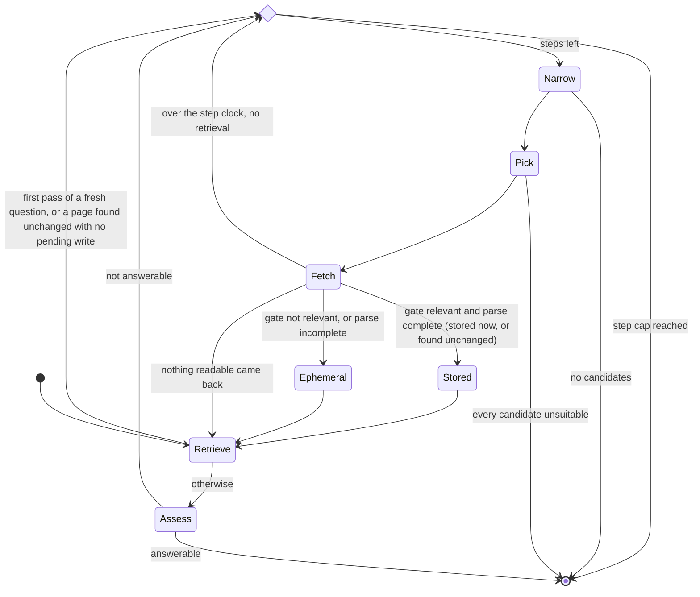

# UniFi web source — crawl, snapshots and automatic growth

This file owns the design of the campus source (the UniFi website, Qdrant collection `unifi_web`): the scope table, multi-collection retrieval, the snapshot and registry layout, the deepening loop's state machine and rules, the decision-log schema and the fallback. The reasons behind each rule of the loop are written in the docstrings of `rag/agent.py` and `rag/live.py`, next to the code they explain; the chunk fields are [docling-pipeline.md](docling-pipeline.md), section 3.6; the eval-isolation rule is [architecture.md](architecture.md); every measurement is [experiment-log.md](experiment-log.md), entries of 2026-08-22 to 2026-08-24; how a page's text enters a prompt, and why that defence against prompt injection is a mitigation and not a guarantee, is [security.md](security.md), row LLM01:2026.

## Scope table

The seed crawl follows a **deterministic scope table**: an LLM relevance verdict on 500 pages one by one is not affordable, so the LLM judges only what automatic growth writes. The scope is not locked to the `unifi.it` domain. Each row's path prefix is a real page and doubles as a seed for the link BFS.

| Section | Rule | Status |
| --- | --- | --- |
| `ingegneria` | `ingegneria.unifi.it/*` | ✅ `rag/crawl.py` `DEFAULT_SCOPE`; crawled 2026-08-22 |
| `servizi` | `www.unifi.it/it/studia-con-noi*` (enrolment, fees, secretariats) | ✅ `rag/crawl.py`; crawled 2026-08-22 |
| `mobilita` | `www.unifi.it/it/ateneo/nel-mondo*` (Erasmus and international mobility) | ✅ `rag/crawl.py`; crawled 2026-08-22 |
| `international` | `www.unifi.it/en/*` (the English site, the entry point for international students) | ✅ `rag/crawl.py`; crawled 2026-08-22 |
| domains students depend on (DSU Toscana, CISIA, …) | an explicit row each, added when an unanswered question shows the need | — |

The crawl's hard limits, all code constants in `rag/crawl.py`: robots.txt respected · one request per second (`REQUEST_INTERVAL_SECONDS`) · at most 500 pages per run (`DEFAULT_MAX_PAGES`, `--max-pages`) · a user agent that states the thesis use · PDF attachments up to 20 MB (`MAX_ATTACHMENT_BYTES`) · read-only. Each host's `sitemap.xml`, then `sitemap.php`, seeds the BFS. Attachments are PDF only: office files and archives (`SKIPPED_EXTENSIONS`: `.doc(x)`, `.xls(x)`, `.ppt(x)`, `.rtf`, `.odt`, `.zip`) are not followed — the office files on these sites are blank forms; the outlink graph records their links all the same. `--sections` crawls a subset of the table, so a follow-up run spends the page cap on new sections.

## Multi-collection retrieval

✅ `search()` in `rag/search.py` takes `collections`; a gold question picks them by its `target`.

- **With rerank**: each collection yields its own fusion pool (20 per pool, `PREFETCH_LIMIT`), the pools are merged, and one rerank takes the top k. Scores are comparable across collections because the reranker reads only the query and the text.
- **With `--no-rerank`**: RRF scores are **not comparable across collections**, so the pools are not merged: each collection gives its top k, the lists are interleaved round-robin by rank and cut to k. This is a definition, not a fusion; the longer list fills the remaining slots.
- The `ingest_source` and `ingest_run_id` condition goes into the `unifi_web` prefetch branches only: the eval-isolation rule of [architecture.md](architecture.md).
- Collections are merged only when the router says `both` (`collections_for()` in `rag/agent.py`); the two non-regression gates, slides and campus, each search one collection.

## Snapshot and registry layout

✅ `rag/crawl.py` writes snapshots, manifests and registry rows; `rag/live.py` appends live rows. Two artefacts with opposite lifecycles:

```
data/webcorpus/
├── <run_id>/
│   ├── manifest.json          # immutable: run_id, created_at, rules, max_pages, pages[{url, file, content_hash, fetch_date}]
│   └── <sha256(url)[:16]>.html|.pdf   # raw pages and attachments, named by a hash of the URL (artifact_name())
└── registry.jsonl             # append-only ledger, written by both crawl and live
```

A registry row (`RegistryEntry` in `rag/crawl.py`): `url · content_hash · fetch_date · ingest_run_id · ingest_source ("crawl" | "live") · trigger · referrer_url · section · outlinks[]` (anchor text and URL). The last row for a URL wins. The ledger has three duties: the **outlink graph** (candidates for growth), the **incremental check** (a page is parsed and indexed again only when its `content_hash` changes) and **rollback grouping** (a run is rolled back by deleting the points of its `ingest_run_id` from Qdrant by payload filter, `delete_by_run()` in `rag/index.py`; the registry names the runs).

- Concurrency: one process writes; readers skip a corrupt row with a warning. Concurrent writers come with the Celery worker, 🔜 M5 `#34`.
- Rolling back a live write keeps the earlier crawl version of the same URL: the index returns to the snapshot.
- Storage: `data/` (gitignored), with the corpus's risk posture.

## The deepening loop

✅ `deepen()` in `rag/agent.py` is the state machine below, and `narrow_candidates()` builds the shortlist; the command is `uv run python -m rag.agent "<question>" [--no-deepen]`. The web API routes and retrieves without the loop (`apps/qa/engine.py`): its fetches write into the shared index and take tens of seconds each, so running it from the site is an asynchronous task, 🔜 M5 `#34`. 🔶 A page the gate passes is stored at once (`rag/live.py`); the decided human confirmation step is `#48`, which has no milestone. The diagram is `deepen()` as the code runs it; every exit ends in generation over the hits gathered, which refuses only when nothing grounds an answer. When a step stored a page and then went over the step clock, and no later step retrieved again, one more retrieval runs before generation, so the answer cites what was stored.



The loop's hard caps and budgets are all code constants:

| Rule | Value | Where | Why |
| --- | --- | --- | --- |
| steps per question | at most 3 fetches | `DEEPEN_MAX_STEPS` | bounds latency and writes into the shared index |
| shortlist | 10 links and 5 PDFs, two separate quotas | `MAX_LINK_CANDIDATES`, `MAX_PDF_CANDIDATES`, `narrow_candidates()` | one page can link forty decree PDFs; one shared quota would let navigation push out the one attachment that answers |
| ranking | cosine between `RouteDecision.query` and the anchor text plus URL path (plus the file name for a PDF), on the shared CPU encoder; never DOM order | `ranking_text()`, `narrow_candidates()` | a page's first links are its navigation; the cosine is plain Python, no numpy |
| candidate source | the outlinks of the hit rows and of the pages fetched this turn; a hit without outlinks (a PDF) falls back to its carrier page's row; pages this step retrieved and pages fetched this turn are excluded | `graph_outlinks()`, `_carrier_row()` | PDF rows record no outlinks; a carrier page lists its own attachments, which would hand the hits back as candidates |
| refusing to pick | allowed: the model may reject the whole shortlist, and no fetch follows | `CandidateChoice.unsuitable`, `pick_candidate()` | a forced pick writes a page the model itself called irrelevant into the shared index |
| unparsable pick | an unparsable reply or an out-of-range number takes the top-ranked candidate, recorded as a fallback | `PICK_FALLBACK_REASON` | a broken reply should not waste a step; the log tells it from a refusal |
| step clock | 60 s, covering the assessment, the pick, the fetch and the gate | `STEP_TIMEOUT_SECONDS` (`rag/live.py`), `_timed_fetch()` | the LLM reload after an unload lands on the next call, so it is charged to the step that causes it; the clock stops when the gate answers |
| over the step clock | the step's content is dropped and the loop moves to the next candidate; a stored page is not undone, and one extra retrieval at the end picks it up | `deepen()` | a write that happened is real; the turn must cite what was stored, not what it replaced |
| PDF parse budget | 120 s, outside the step clock | `PDF_PARSE_TIMEOUT_SECONDS` (`rag/live.py`) | the corpus's largest PDF needs 66–69 s on CPU |
| LLM request ceiling | 30 s | `DEFAULT_TIMEOUT_SECONDS` (`rag/llm.py`) | the SDK's default of ten minutes per request would void any budget |
| ephemeral chunks | 5 in the turn's context | `EPHEMERAL_CHUNK_LIMIT`, `rank_chunks()` | the page is not in the index, so the loop ranks it, to the same size as the retrieval top-k |
| live parsing | CPU, classic pipeline, no OCR, at most 40 pages | `LIVE_MAX_PDF_PAGES` (`rag/live.py`) | the three models on the GPU leave no room for a PDF parse |
| live dense encoding | on CPU, through the one encoder per (model, device) that `rag/index.py` caches; its first load and every encode run outside the step clock | `cached_dense_encoder()` (`rag/index.py`) | encoding 13–18 chunks takes 77–117 s on CPU: charged to the step, every successful write would count as a timeout; costs that amortise or have a budget of their own stay off the clock |
| unloading the LLM | `ollama stop` between the gate and the parse, local Ollama only | `maybe_unload_llm()` (`rag/live.py`) | frees GPU memory; a no-op on any other endpoint |
| `--no-deepen` | follows no page link: the shortlist holds linked PDFs only, in the same cosine order, without the top-5 cut | `narrow_candidates(link_hopping=False)` | the two arms then differ in link hopping alone |

## Decision log

✅ `Decision` in `rag/agent.py`, appended to `data/webcorpus/decisions.jsonl` (`--decision-log` changes the path); the raw material of the error taxonomy (`#23`). A row is `run_id · question_id · step · candidates[] · choice · reason · outcome`. `candidates[]` keeps the anchor text, without which "the shortlist was wrong" cannot be told from "the model chose wrong". `outcome` is one of:

- `answered` — the assessment judged the material enough;
- `persisted` — the fetched page was stored;
- `already indexed` — the page was in the index, unchanged: the knowledge base did not grow, retrieval had not surfaced it;
- `ephemeral` — the gate refused the page or its parse was incomplete; it is read this turn only;
- `not retrieved` — nothing readable came back;
- `timeout` — the step went over its clock;
- `no candidates` — the graph offered nothing, or nothing survived the narrowing;
- `unsuitable` — a shortlist existed and the model rejected all of it;
- `steps exhausted` — the step cap was reached.

## Fallback

When a turn ends with no hit, generation refuses without calling the LLM (`rag/answer.py`), and the command-line agent adds `pointer_line()` in Italian, English or Chinese: paste the URL of the page that holds the answer, which is how the shared index grows. The web API does not add it.
